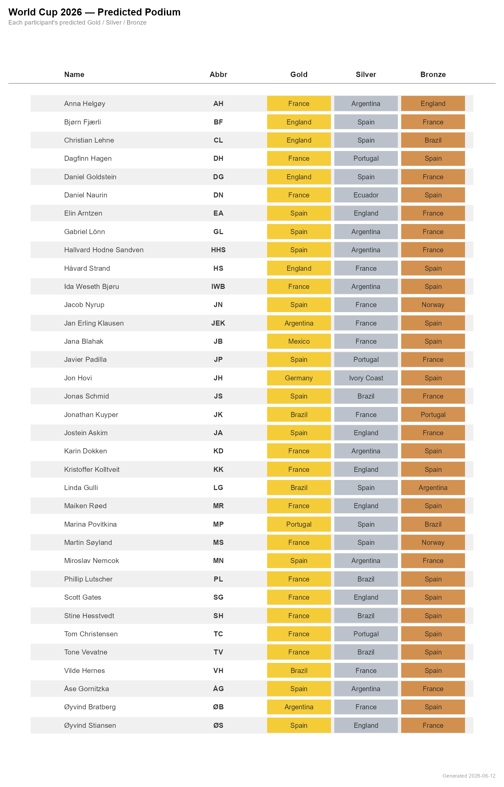
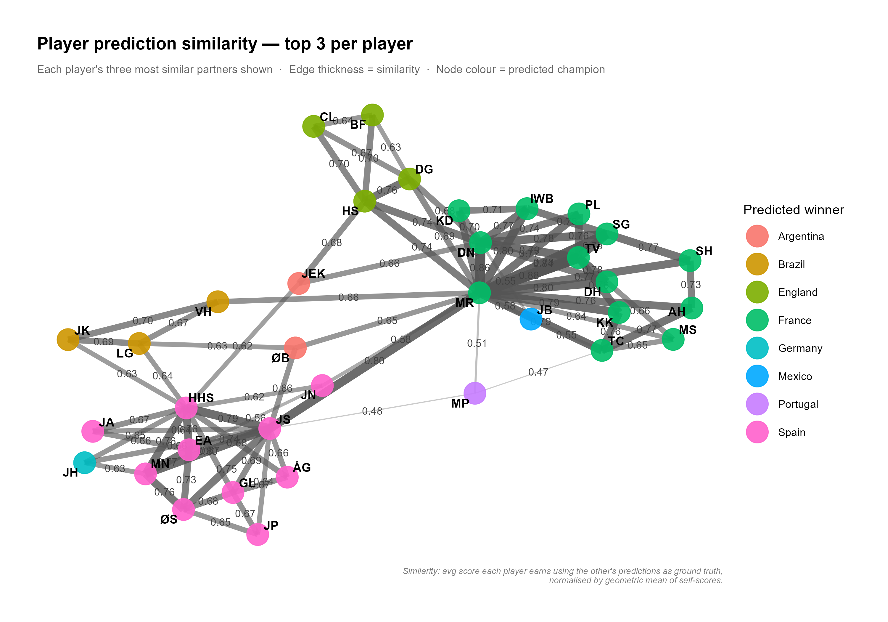

We are 35 participants in this competition. The table below lists all names and abbreviations, and these might be used occasionally throughout the competition. 

We mainly fancy France and Spain to win the tournament. Some of us Brazil and England, and then Øivind and Jan Erling have Argentina as their winner, while Jana goes with Mexico, Jon predict German glory, and Marina favors Portugal. 

The network graph shows similarity between us. The numbers indicate how many percent of the total 4600 points a given player gets if the node on the other end happens to be 100% correct. If Jon's predictions were to become reality, Martin would not even get 2000 points. Maiken and Jonas are joint hubs in this network. That has traditionally not been a bad place to be.

