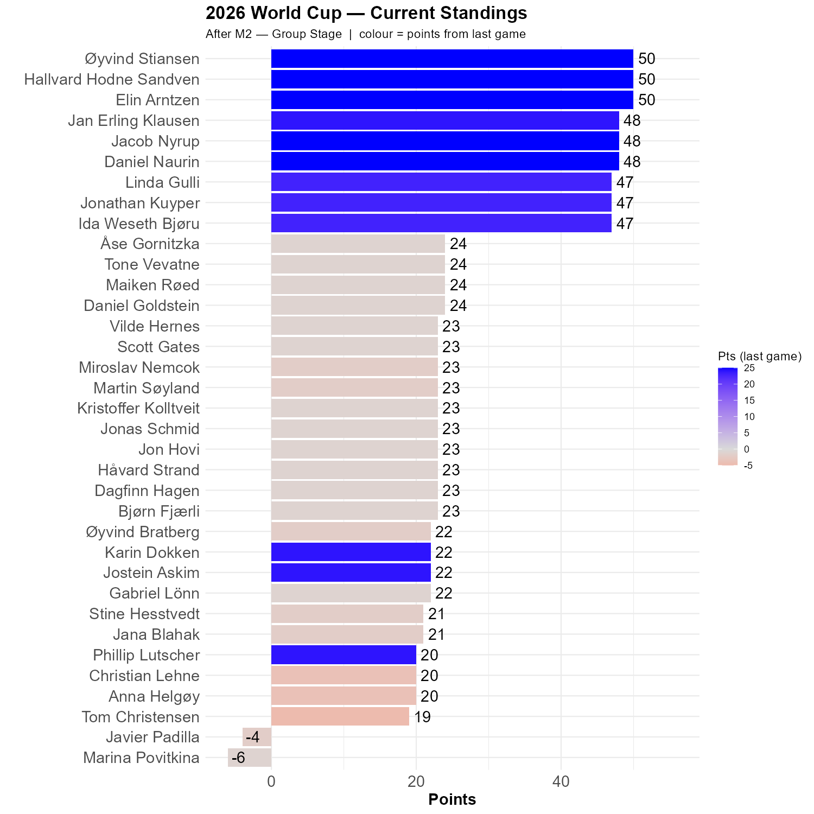

# South Korea vs Czechia

```{r init, echo=FALSE, message=FALSE , warning=FALSE}

library(tidyverse)
library(igraph)
library(readxl)
library(knitr)

knitr::opts_chunk$set(out.width = "100%")

```

Czechia scored first, but the country with the highest per capita beer consumption got overrun in the second half. 

```{r} 
#| label: graph
#| echo: false
#| warning: false
#| fig-height: 10
#| fig-width: 10


library(tidyverse)

invisible(capture.output(Sys.setlocale()))

# ── Parameter ─────────────────────────────────────────────────────────────────
lag <- 1   # number of games back for the colour fill; change as needed

# ── Load data ─────────────────────────────────────────────────────────────────
df <- read_delim(here::here("gData", "standings.csv"), delim = ";",
                 locale = locale(encoding = "UTF-8"),
                 show_col_types = FALSE) |>
  mutate(full_name = if_else(is.na(full_name) | full_name == "", player, full_name))

last_match_no  <- max(df$match)
last_stage     <- df |> filter(match == last_match_no) |> pull(stage) |> first()
played_matches <- sort(unique(df$match))

# Score lag games ago (or 0 if fewer games have been played)
lag_match <- if (length(played_matches) > lag) {
  played_matches[length(played_matches) - lag]
} else {
  NA_integer_
}

lag_scores <- if (!is.na(lag_match)) {
  df |> filter(match == lag_match) |> select(player, lag_score = cumulative)
} else {
  tibble(player = unique(df$player), lag_score = 0L)
}

# ── Current standings ─────────────────────────────────────────────────────────
hbar <- df |>
  filter(match == last_match_no) |>
  left_join(lag_scores, by = "player") |>
  mutate(
    lag_score = replace_na(lag_score, 0L),
    diff      = cumulative - lag_score,
    full_name = fct_reorder(full_name, cumulative)
  )

lag_label <- if (lag == 1) "last game" else paste0("last ", lag, " games")

# ── Plot ──────────────────────────────────────────────────────────────────────
p <- ggplot(hbar, aes(x = full_name, y = cumulative, fill = diff)) +
  geom_col() +
  scale_y_continuous(limits = c(min(min(hbar$cumulative), 0), max(hbar$cumulative) * 1.12)) +
  coord_flip() +
  scale_fill_gradient2(low = "red", high = "blue", mid = "grey85", midpoint = 0,
                       name = paste0("Pts (", lag_label, ")")) +
  geom_text(aes(label = cumulative), hjust = -0.25, size = 5) +
  ylab("Points") +
  xlab(" ") +
  labs(
    title    = "2026 World Cup — Current Standings",
    subtitle = paste0("After M", last_match_no, " — ", last_stage,
                      "  |  colour = points from ", lag_label)
  ) +
  theme_minimal() +
  theme(
    axis.text  = element_text(size = 14),
    axis.title = element_text(size = 14, face = "bold"),
    plot.title = element_text(face = "bold", size = 16)
  )
ggsave("standings.png",
       width = 10, height = 10, dpi = 150)


```

Øyvind, Elin and Hallvard have 50 points -- perfect score so far. 6 more contenders have correct result, but some deviance when it comes to the score.

But, it is still early.

```{r show, echo=FALSE}

```

