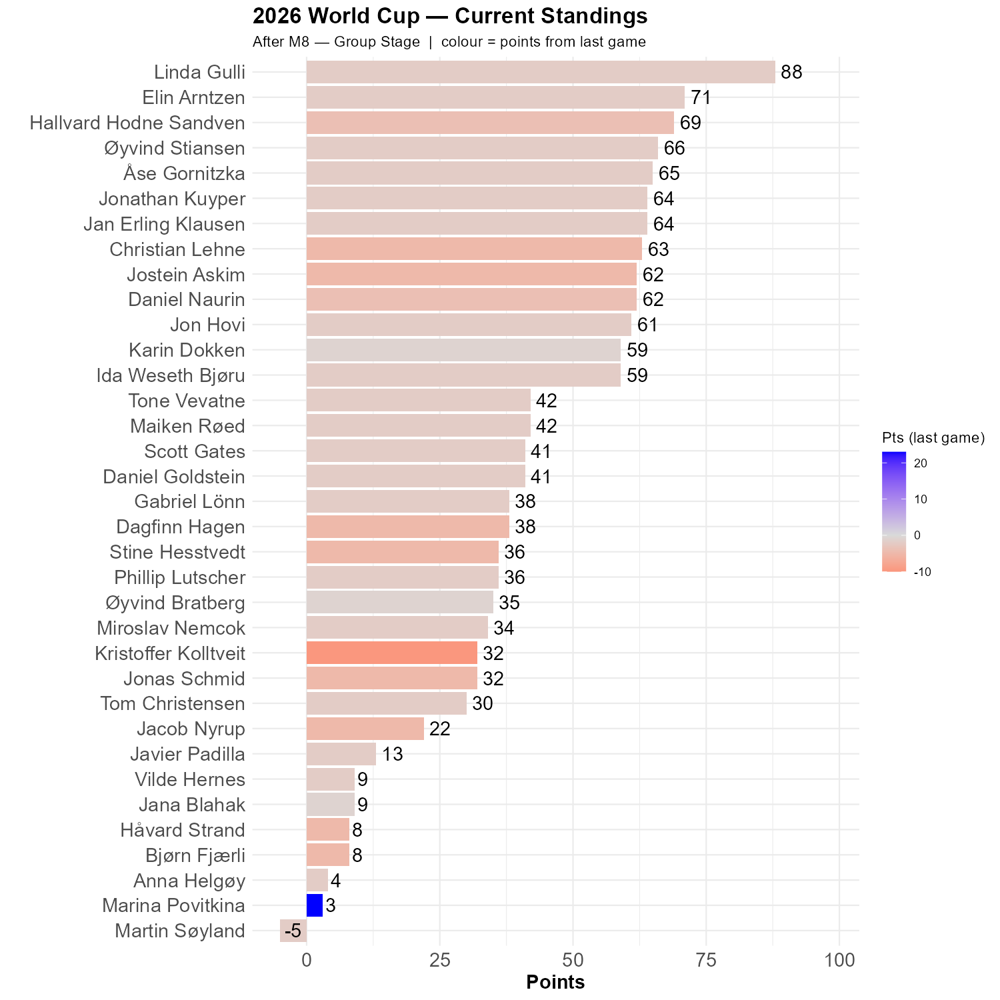

# Switzerland vs Qatar

A game between Infantino's original home country and his adopted home country. The man is widely assumed to be "influentialable", but who will he support today? Or, who will support him? The offside after 15 minutes was interesting, but in the end the game was a draw. 

So, what does that with our competiton?

```{r standings, echo=FALSE, message=FALSE, warning=FALSE}
source(here::here("R", "plot_standings.R"))
this_match <- 8
lag        <- 1
plot_standings(this_match, lag)
```

Scoll down to the bottom, and admire Marina's reenactment of dr. Stockman's stance. "The strongest man in the world is he who stands most alone". Linda remain in front of the race, as very little changed after this game.

```{r show, echo=FALSE}

```
