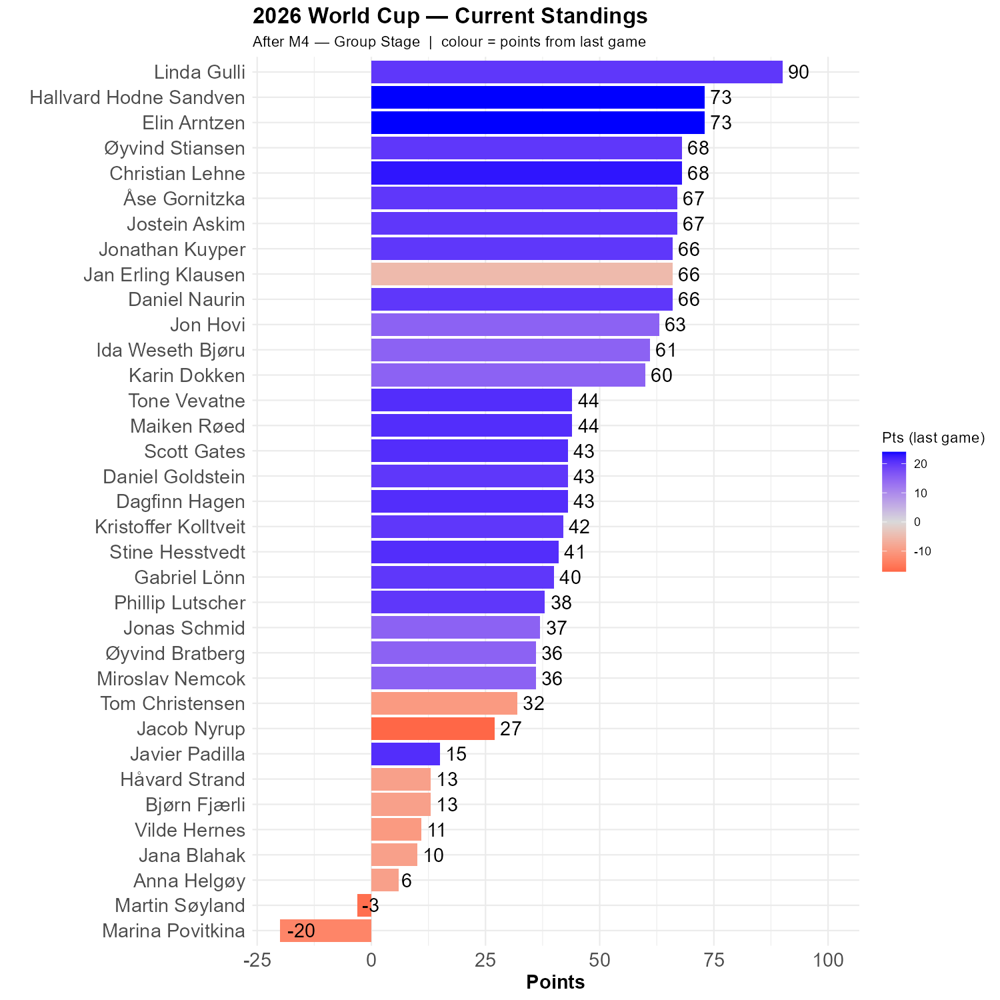

# US beats Paraguay 4-1. 

That the 15th ranked team in the world can outplay the 45th ranked team is perhaps not a surprise. But for some of us it was. Particularly the margin. 

```{r init, echo=FALSE, message=FALSE , warning=FALSE}
library(tidyverse)
library(ggplot2)

# ── Parameter ─────────────────────────────────────────────────────────────────
this_match <- 4   # which game this post covers — never changes on re-render
lag        <- 1   # number of games back for the colour fill

# ── Load data ─────────────────────────────────────────────────────────────────
df <- read_delim(here::here("gData", "standings.csv"), delim = ";",
                 locale = locale(encoding = "UTF-8"),
                 show_col_types = FALSE) |>
  mutate(full_name = if_else(is.na(full_name) | full_name == "", player, full_name))

played_matches <- sort(unique(df$match))

# ── Lag scores ────────────────────────────────────────────────────────────────
lag_match_idx <- match(this_match, played_matches) - lag
lag_match <- if (!is.na(lag_match_idx) && lag_match_idx >= 1) {
  played_matches[lag_match_idx]
} else {
  NA_integer_
}

lag_scores <- if (!is.na(lag_match)) {
  df |> filter(match == lag_match) |> select(player, lag_score = cumulative)
} else {
  tibble(player = unique(df$player), lag_score = 0L)
}

# ── Current standings ─────────────────────────────────────────────────────────
hbar <- df |>
  filter(match == this_match) |>
  left_join(lag_scores, by = "player") |>
  mutate(
    lag_score = replace_na(lag_score, 0L),
    diff      = cumulative - lag_score,
    full_name = fct_reorder(full_name, cumulative)
  )

last_stage <- hbar |> pull(stage) |> first()
lag_label  <- if (lag == 1) "last game" else paste0("last ", lag, " games")

# ── Plot ──────────────────────────────────────────────────────────────────────
p <- ggplot(hbar, aes(x = full_name, y = cumulative, fill = diff)) +
  geom_col() +
  scale_y_continuous(limits = c(min(min(hbar$cumulative), 0), max(hbar$cumulative) * 1.12)) +
  coord_flip() +
  scale_fill_gradient2(low = "red", high = "blue", mid = "grey85", midpoint = 0,
                       name = paste0("Pts (", lag_label, ")")) +
  geom_text(aes(label = cumulative), hjust = -0.25, size = 5) +
  ylab("Points") +
  xlab(" ") +
  labs(
    title    = "2026 World Cup — Current Standings",
    subtitle = paste0("After M", this_match, " — ", last_stage,
                      "  |  colour = points from ", lag_label)
  ) +
  theme_minimal() +
  theme(
    axis.text  = element_text(size = 14),
    axis.title = element_text(size = 14, face = "bold"),
    plot.title = element_text(face = "bold", size = 16)
  )

ggsave("standings.png",
       width = 10, height = 10, dpi = 150)
```

Linda is alone in the top, with Elin and Hallvard right behind. A strong group of contenders are right behind.

```{r show, echo=FALSE}

```

None of us had 4-1 down as the result. Elin and Hallvard had 3-1 as their result, and were rewarded handsomely. This is the dot right below the marker in the plot. Christian had 3-2, which was almost as good. 6 of us had 1-0, resulting in 15 points rather than the full 25. 

```{r scatter_points, echo=FALSE, message=FALSE , warning=FALSE}
source("../../R/group_stage_scatter.R")
plot_match(4, save = TRUE) 
```

