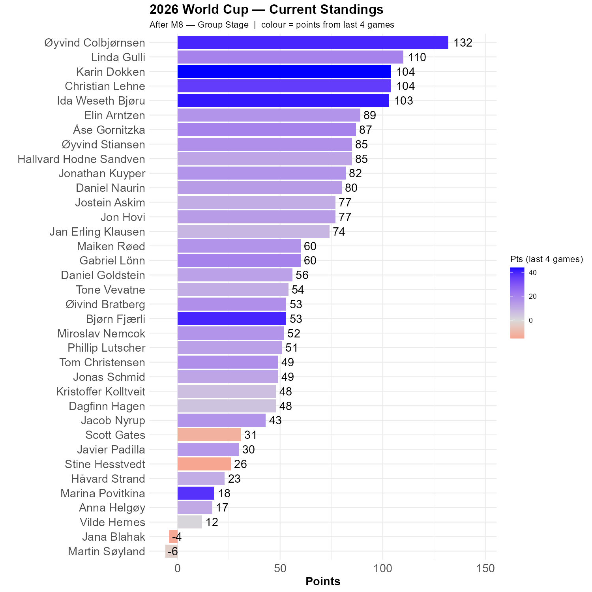

# A fairly significant administrative issue

The first point of the agenda is that I have made a horrible mistake. Øyvind Colbjørnsen's contribution was regrettably omitted. This error has now been corrected, with important implications for our competition. Because not only did Øyvind C correctly guess 1-1 as the result in the Brasil - Morocco game, he has also made more correct predictions than any other participant. Which places him at the very top of the competition. 


# Haiti vs Scotland

Haiti came close to replicating Qatar's feat, but in the end Scotland won 1-0. Which is potentially important for our competiton in several ways.

Scotland is unlikely to get points from either Morocco or Brasil, and therefore likely to end up in 3rd with a negative goal difference. This might jeopardize their chances for getting to the knockout stage.

Haiti's result means that they are most likely to end up with 0 points, and should either Curacao or New Zealand get a point, this will be decisive for the qualitiative question regarding these teams.

# Australia vs Turkey

Austalia beat Turkey 2-0 this morning, and thereby more or less securing their progress into the next round. Turkey is not completely without hope, but they might have to beat Paraguay with quite a margin to secure progress. 

```{r standings, echo=FALSE, message=FALSE, warning=FALSE}
source(here::here("R", "plot_standings.R"))
this_match <- 8
lag        <- 4
plot_standings(this_match, lag)
```

I haven't had a chance to fix the coloring issue, so today's update covers points in all four games played yesterday American time. Øyvind Colbjørnsen enters the standings at the very top, with Karin, Ida, Bjørn and Marina begin significant achievers.

```{r show, echo=FALSE}

```