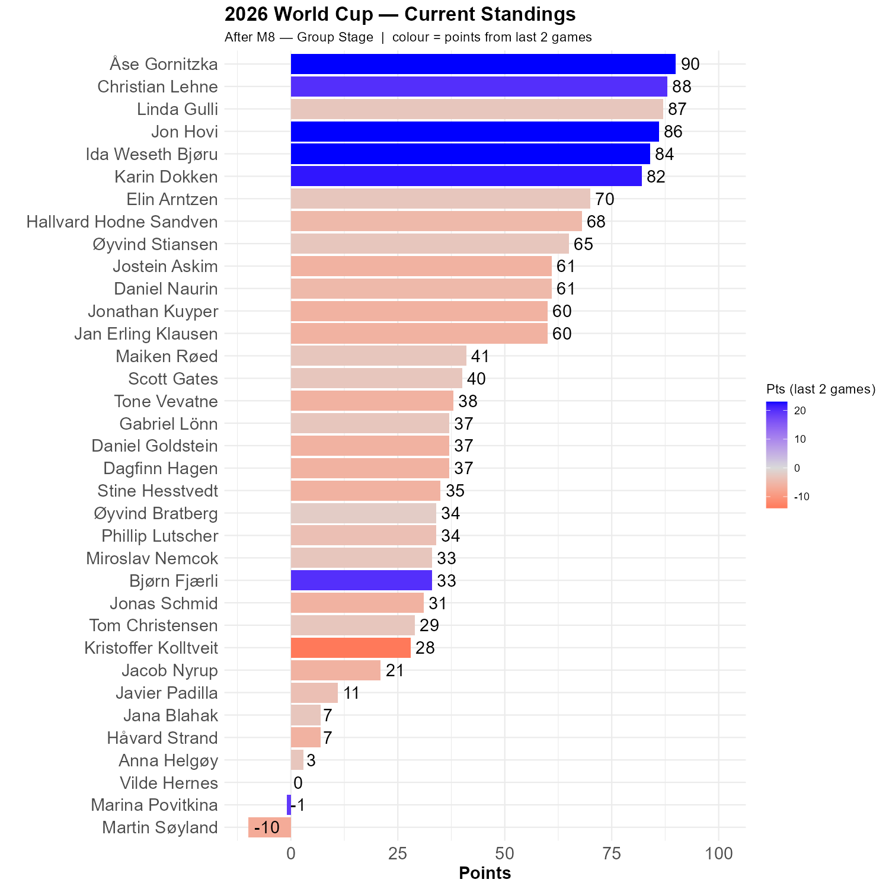

# Brazil vs. Morocco

The first half was amazing, and the best half so far in this cup. The second half was not so good. 


```{r standings, echo=FALSE, message=FALSE, warning=FALSE}
source(here::here("R", "plot_standings.R"))
this_match <- 8
lag        <- 2
plot_standings(this_match, lag)
```

Åse is in the lead, followed by Christian, Linda, Jon, Ida and Karin. Elin, Hallvard and Øyvind have been distanced somewhat, and joined by a gang of four. But much can still happen

The colors are a bit off here. My system finds it hard to cope with game 7 being played after game 8. It is a bit late to mend that now.

```{r show, echo=FALSE}

```

No less than five players had the correct result from this game, while Karin had 2-2. Jostein and Elin had Morocco as winners, and that could have happened as Allison almost gave away a goal in injury time.

```{r scatter_points, echo=FALSE, message=FALSE , warning=FALSE}
source("../../R/group_stage_scatter.R")
plot_match(7, save = TRUE) 
```

