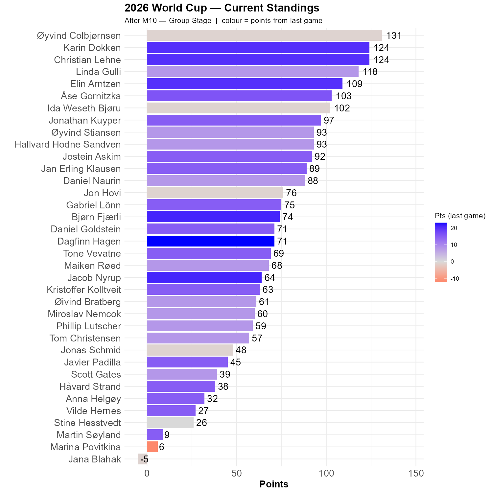

# Germany beats Curacao.

Samuel 17:49. He reached into his bag and took out a stone, which he slung at Goliath. It hit him on the forehead, and Goliath looked back and said: "Nice try". Except Curacao didn't score at 17:49, it was 20:45.

```{r standings, echo=FALSE, message=FALSE, warning=FALSE}
source(here::here("R", "plot_standings.R"))
this_match <- 10
lag        <- 1
plot_standings(this_match, lag)
```

Øyvind is still in the lead, but Karin and Christian is right behind. Øyvind actually lost one point, despite having a German victory. His 2-0 estimate yielded 25 points for correct outcome and 26 points deduction for dramatically wrong score. This round's rockets are Dagfinn (6-0) and Bjørn & Jacob (5-1). 

```{r show, echo=FALSE}

```
Everyone believed in Germany, but the score differentiated a lot. Only four of us saw Curacao score.

```{r scatter_points, echo=FALSE, message=FALSE , warning=FALSE}
source("../../R/group_stage_scatter.R")
plot_match(10, save = TRUE) 
```