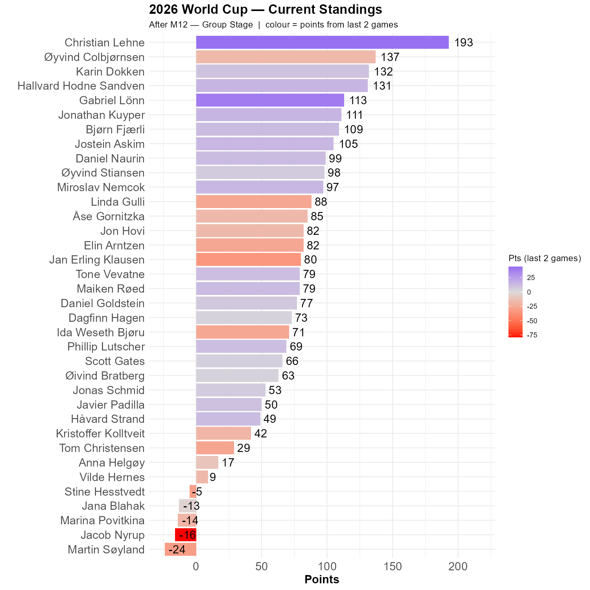

# Yellow

## Ivory Coast vs. Ecuador

According to reports, this was the best game so far, where dark horse candidate Ecuador failed to live up to the hype. Ecuador on their side had abandoned their yellow jersey for the away blue. Many of us had bought into the hype. Only Christian, Gabriel, Jana and Karin saw Ivory Coast winning this game.

## Sweden vs. Tunisia

Sweden did play in yellow and completely hammered Tunisia. The 5-1 score will be important, because none of us saw this happening. Christian was closest with 3-1, while Jacob had bravely predicted a 0-8 score for Tunisia.

```{r standings, echo=FALSE, message=FALSE, warning=FALSE}
source(here::here("R", "plot_standings.R"))
this_match <- 12
lag        <- 2
plot_standings(this_match, lag)
```

Christian is now ahead by 56 points! Øyvind, Karin and Hallvard form a trio in pursuit, and Gabriel is catching up fast.

```{r show, echo=FALSE}

```
The resent results underscore the importance of not undersestimating the big wins. 
```{r scatter_points, echo=FALSE, message=FALSE , warning=FALSE}
source("../../R/group_stage_scatter.R")
plot_match(12, save = TRUE) 
```