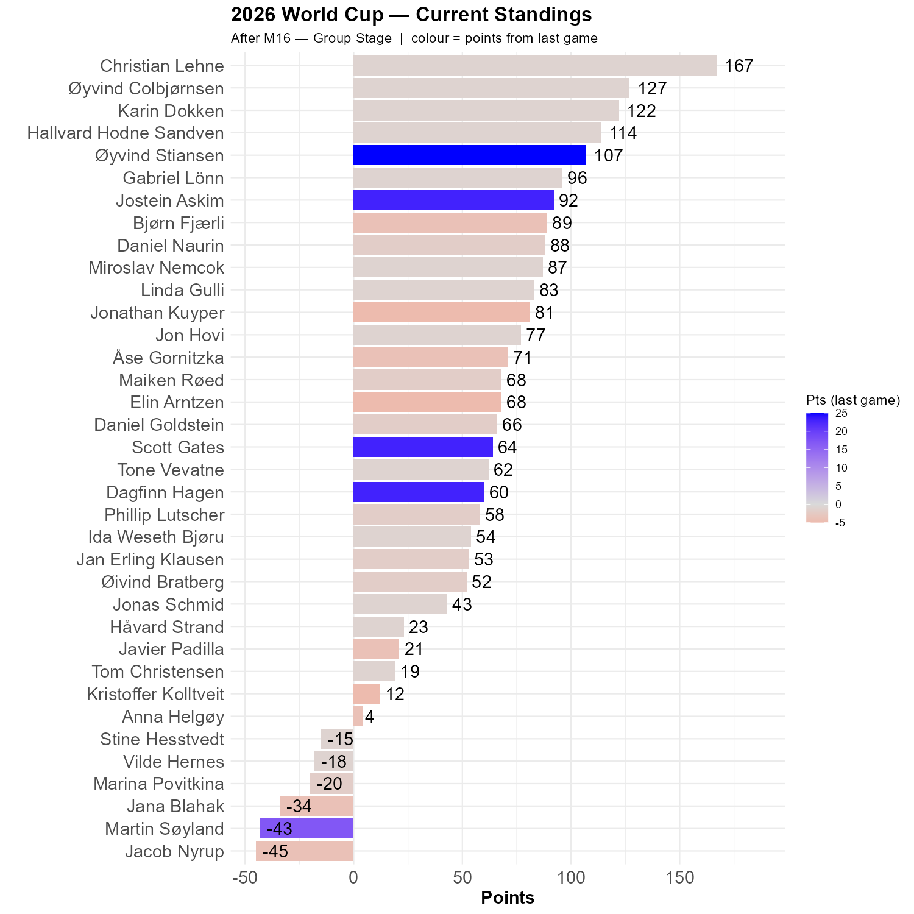

# Belgium vs Egypt

A relatively even game resulted in an absolutely even score. After the red card bonanza in the first game, we have seen very few of those. Can we make it below 7 red cards in the tournament?

```{r standings, echo=FALSE, message=FALSE, warning=FALSE}
source(here::here("R", "plot_standings.R"))
this_match <- 16
lag        <- 1
plot_standings(this_match, lag)
```

Christian remain ahead by 40 points! Øyvind, Karin and Hallvard remain a trio in pursuit. Øyvind Stiansen and Jostein Askim are closing in. Scott, Dagfinn and Martin also got points from this round.

```{r show, echo=FALSE}

```
Belgium were our favorites. Three of us believed in Egypt, while five got the correct result.
```{r scatter_points, echo=FALSE, message=FALSE , warning=FALSE}
source("../../R/group_stage_scatter.R")
plot_match(16, save = TRUE) 
```
