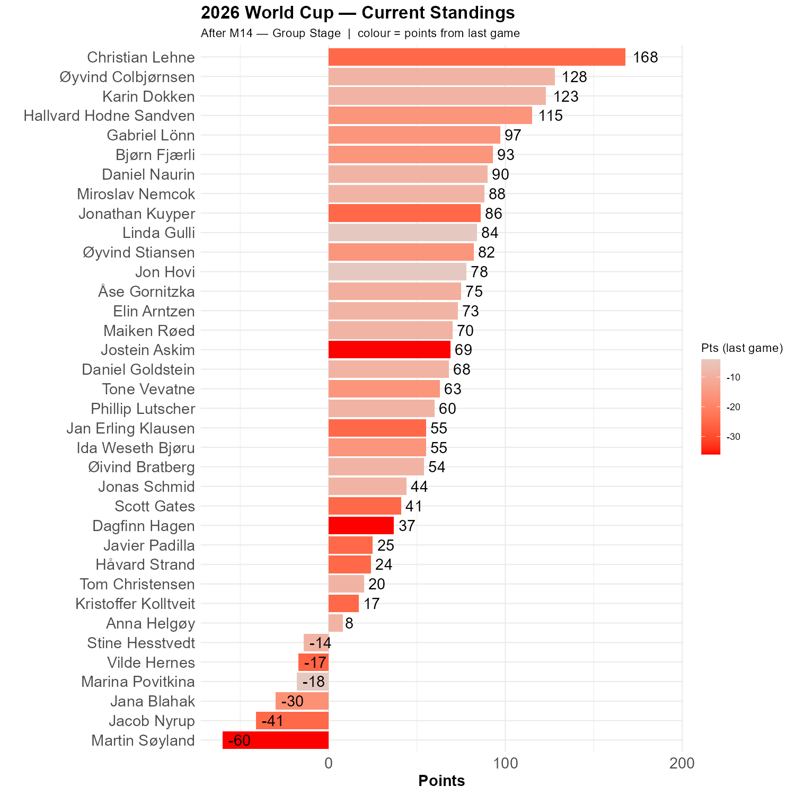

# A bomb indeed!

This result came as proper surprise. From the betting market's point of view, this game was even more predetermined than the Germany game. We all had Spain as the winner, ranging from 6-0 (Martin, Jostein & Dagfinn) to 2-0 (Jon, Linda and Marina). 

```{r standings, echo=FALSE, message=FALSE, warning=FALSE}
source(here::here("R", "plot_standings.R"))
this_match <- 14
lag        <- 1
plot_standings(this_match, lag)
```

Christian is now ahead by 40 points! Øyvind, Karin and Hallvard remain a trio in pursuit. This is probably the collectively low point of the entire ISV tipster competition history. 

```{r show, echo=FALSE}

```