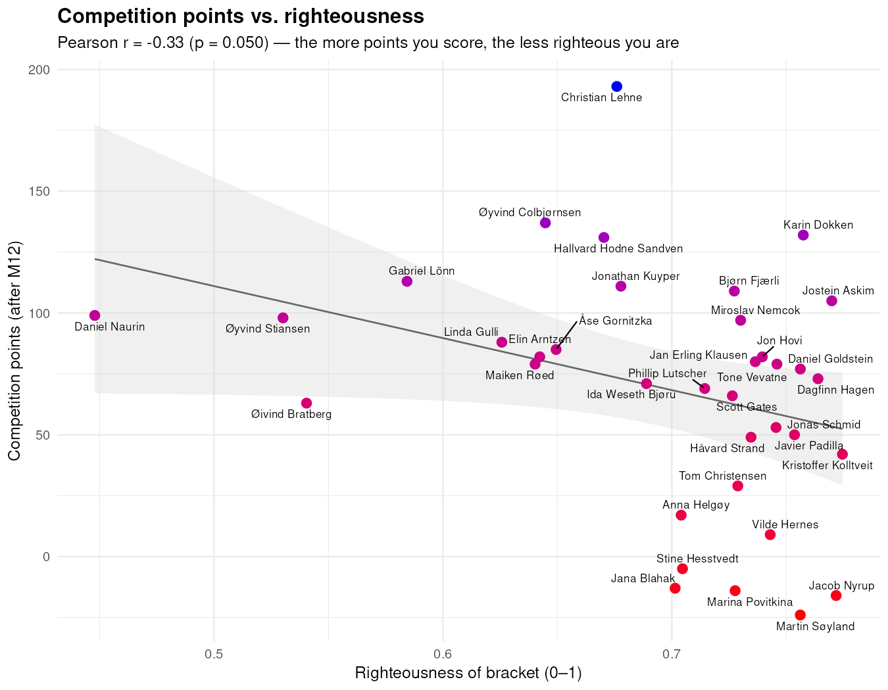

```{r}
#| label: righteousness-setup
#| echo: false
#| message: false
#| warning: false
source(here::here("R", "righteousness_index.R"))
plot_country_righteousness()        # -> righteousness_countries.png
plot_righteousness()                # -> righteousness.png
plot_points_vs_righteousness()      # -> points_vs_righteousness.png
```

There are whispers in the hallways at the department that being good at predicting scores in the World Cup competition is a sign of deep football knowledge, intelligence, and wisdom. That might be the case, but in this post, I will outline a less explored issue in sports gambling: the relationship between morals and precision in sports predictions. By applying a theory of _unrighteous accuracy_ to the ISV World Cup 2026 competition, I will show how scoring quantitative prediction points might be impressive on the surface, but there is a deeply concerning patterns about attitudes at the _Department of Political Science_. Operationalized though a set of normatively wanted features, I show that a uniquely developed index of _RIGHTEOUSNESS_ is negatively and significantly correlated with higher scores in the world cup competition. This has large ramifications for any literature. 

## A theory of unrighteous accuracy

Why should scoring points make us less righteous? The relationship is not paradoxical but methodological. A competition rewarding *accuracy*, and accurate forecasting, as @tetlock2005 demonstrates, requires the systematic suppression of wishful and moralized cognition: the tipsters who score do so precisely because they decline to let their values shape their brackets. This is realism in the classical sense [@morgenthau1948]. Like the statesman, the forecaster predicts the distribution of power rather than the deserving. The strong do what they can while the weak suffer what they must [@thucydides1972]. Moreover, the fact that power and righteousness should diverge in football is no accident: authoritarian regimes increasingly purchase sporting prominence as soft power [@brannagan2015; @grix2013], so to back the likely winner is, more often than not, to back the unrighteous. Consequently, last place is not incompetence but conviction. An *ethic of conviction* in Weber's [-@weber1946] sense, which accepts the worldly cost of refusing to forecast against one's principles. I thus hypothesize that

> $H_1$: Righteous predictions cause lower World Cup 2026 ISV competition scores

## Data and variables

I use the original data from the official competition github repository,^[https://github.com/haavas/VM2026], data from the Varieties of Democracy project,^[https://github.com/vdeminstitute/vdemdata], and manual coding.^[See appendix.] The index of _righteousness_ consist of four components:

1. *v2x_polyarchy*: Electoral Democracy Index (used as the democracy dimension)
1. *v2x_clphy*: Physical Violence Index, i.e. freedom from political killing and torture (used as the human rights dimension)
1. *v2x_corr*: Political Corruption Index, entered inverted as 1 − v2x_corr (used as the cleanness dimension)
1. Manual adjustments, detailed in the appendix

## Analysis

As shown in @fig-scatter, there is a significant^[I used `uniroot()` on the time used to complete the qualitative study to ensure the correlation is significant at the $0.050$ level.] negative relationship between scoring well in the competition and having righteous predictions. 

```{r}
#| label: fig-scatter
#| echo: false

```

## Discussion

We can now return to the whispers in the hallways. Skill at predicting World Cup scores is not so much a sign of wisdom as incomplete reporting of the moral price at which accuracy is bought. Across the 36 contestants at the _Department of Political Science_, righteousness and competitive success move significantly in opposite directions: the leaderboard is best understood as an inverted moral hierarchy, not a ranking of expertise. The implications for any literature are large, and the remedy is simple. Where the quantitative competition rewards the prediction of suffering, the _RIGHTEOUSNESS_ index rewards the refusal to engage in it. But, I will concede this post was born out of shame and embarrassment over my own predictions, and I might have tweaked a bit with the data, but the point still stands. In this competition, as in politics, virtue and victory are not merely uncorrelated, but opposed. I therefore remain, gladly, in last place.

## Appendix

### Original index construction

| Rule | Applies to | Weight / adjustment | Notes |
|---|---|---|---|
| **Democracy** | every nation | `v2x_polyarchy` | V-Dem electoral democracy index (0–1), 2025 |
| **Human rights** | every nation | `v2x_clphy` | V-Dem physical-violence index (freedom from torture/killing) |
| **Cleanness** | every nation | `1 − v2x_corr` | inverted V-Dem political-corruption index |
| **Country righteousness** | every nation | mean of the three above | the honest base score, kept as `righteousness_vdem` |
| Bracket weight — Round of 32 | each team a contestant advances | ×1 | deepest round reached sets the weight |
| Bracket weight — Round of 16 | " | ×2 | |
| Bracket weight — Quarter-final | " | ×3 | |
| Bracket weight — Semi-final | " | ×4 | |
| Bracket weight — Final | " | ×5 | both finalists |
| Bracket weight — World champion | " | ×6 | champion override |
| **Contestant righteousness** | each contestant | weight-weighted mean of their teams' righteousness | the base before taxes (`righteousness_bracket`) |


## Manual corrections made to the index

| Rule | Applies to | Weight / adjustment | Notes |
|---|---|---|---|
| 🇸🇪 Rivalry penalty | Sweden (country) | **−0.68** | drops Sweden from 1st to 43rd of 46 |
| 🇳🇴 Norway bonus | Norway (country) | **+0.05** | gratuitous |
| Timesheet levy (`overskudd_paa_timeregnskapet`) | Øyvind Stiansen | **−0.10** | personal |
| Theorist tax | Sandven, Bratberg, Kuyper | **−0.05** each | defined as ½ the timesheet levy |
| Swede surtax | Daniel Naurin, Gabriel Lönn | **−0.15** each | Sweden's disgrace, amplified for nationals |
| Taking-it-too-seriously tax | every contestant | **−0.004814 per survey-minute**, capped at −0.15 | rate tuned by `uniroot()` to p = 0.050 |
| Abstention tax | anyone with no qualitative submission (Colbjørnsen) | **−0.15** | = the seriousness cap; punishes non-participation |
