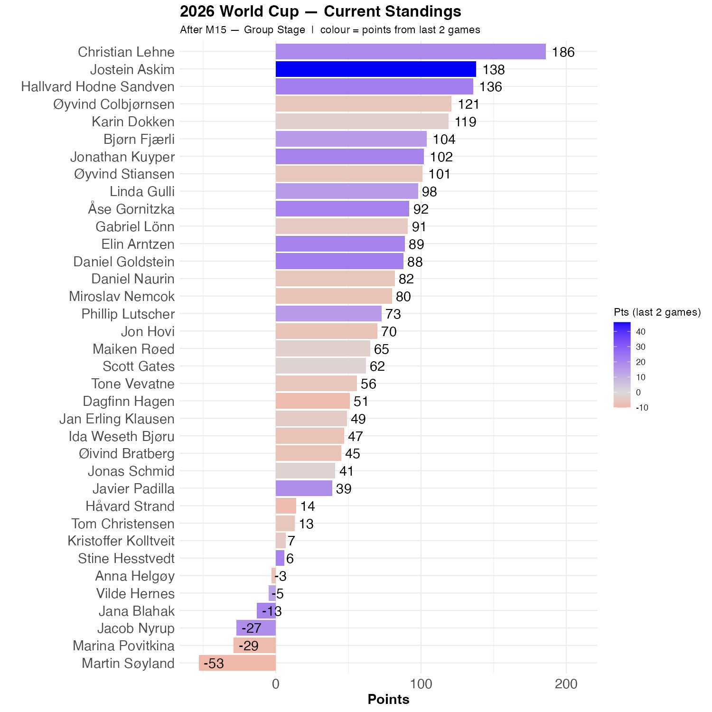

# Saudi Arabia drew against Uruguay

The Saudi league has been ridiculed, but they held Uruguay to a draw, albeit with some difficulty. Uruguay was the better team in the second half, and should have won. Åse had the exact right result, and Jostein the right outcome. 

# New Zealand got a point

New Zealand held Iran to a draw and is thus a very likely candidate as the best of the three lowest ranked teams in the competition. The outcome was not as surprising as the ranking should have suggested (and AI-models predicted). 14 of us had a draw, this was the modal outcome. 

Jostein again were among the 14, and is now in 2nd place, 48 points behind Christian. Hallvard is two points behind Jostein, while Øyvind C and Karin lost ground over these two games.

```{r standings, echo=FALSE, message=FALSE, warning=FALSE}
source(here::here("R", "plot_standings.R"))
this_match <- 15
lag        <- 2
plot_standings(this_match, lag)
```


```{r show, echo=FALSE}

```
Many lost points today, but the 2-2 score means that noone lost a lot.


```{r scatter_points, echo=FALSE, message=FALSE , warning=FALSE}
source("../../R/group_stage_scatter.R")
plot_match(15, save = TRUE) 
```