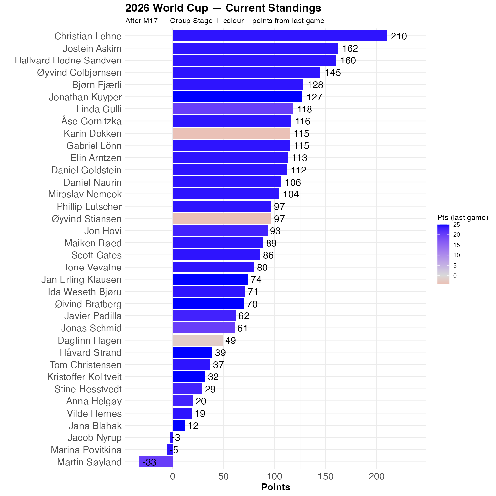

# France vs Senegal

Senegal is a very good team, but France won 3-1. 

Almost all of had a French victory, but the numbers varied somewhat. That means the standings are pretty much as they were.

```{r standings, echo=FALSE, message=FALSE, warning=FALSE}
source(here::here("R", "plot_standings.R"))
this_match <- 17
lag        <- 1
plot_standings(this_match, lag)
```


```{r show, echo=FALSE}

```