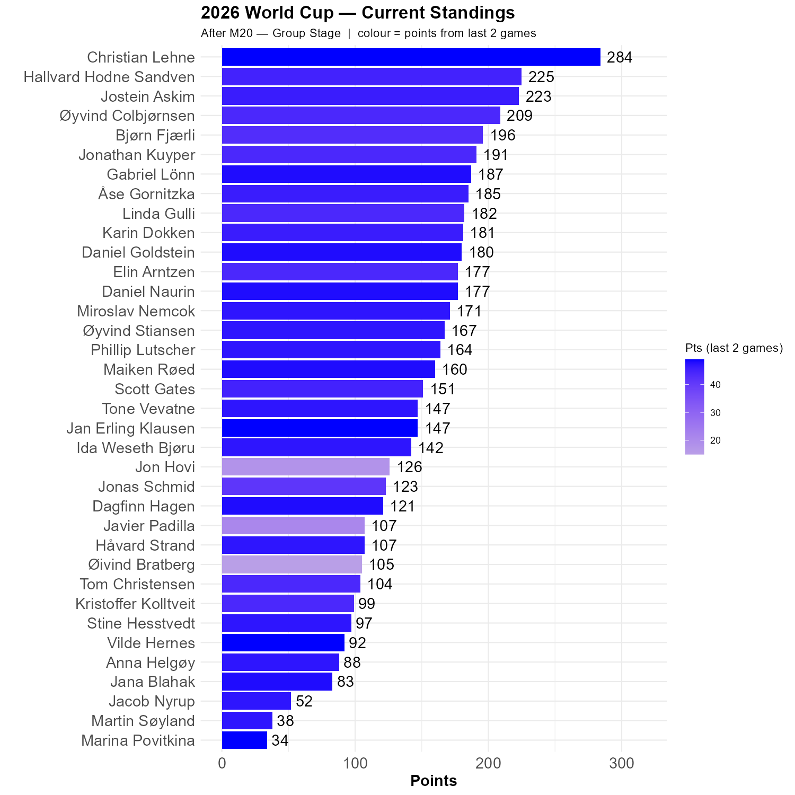

# Group J is a normal group

No surprising results here. So, we are finally all on positive scores!

```{r standings, echo=FALSE, message=FALSE, warning=FALSE}
source(here::here("R", "plot_standings.R"))
this_match <- 20
lag        <- 2
plot_standings(this_match, lag)
```

Christian's lead is up to 59 points, with Hallvard and Jostein in pursuit. There are fewer clusters, which means that the actual score can affect standings significantly.

```{r show, echo=FALSE}

```

## Argentina vs. Algerie

Messi with a hat trick. If he continues like this, he could be up there with Maradonna. Time will tell. Almost everyone Argentina winning, and Scott, Hallvard, Christian, Daniel N, Daniel G, Javier, Marina, Vilde and Øivind got the correct result. 3-0 means that nobody lost a lot of points. 

```{r scatter_points, echo=FALSE, message=FALSE , warning=FALSE}
source("../../R/group_stage_scatter.R")
plot_match(19, save = TRUE) 
```
## Austria - Jordan 

Austria vs Jordan is a bit like Switzerland vs Qatar, except that Austria did the job. As almost all of us thought. Martin and Jonathan got the exact right result.

```{r scatter_points, echo=FALSE, message=FALSE , warning=FALSE}
source("../../R/group_stage_scatter.R")
plot_match(20, save = TRUE) 
```