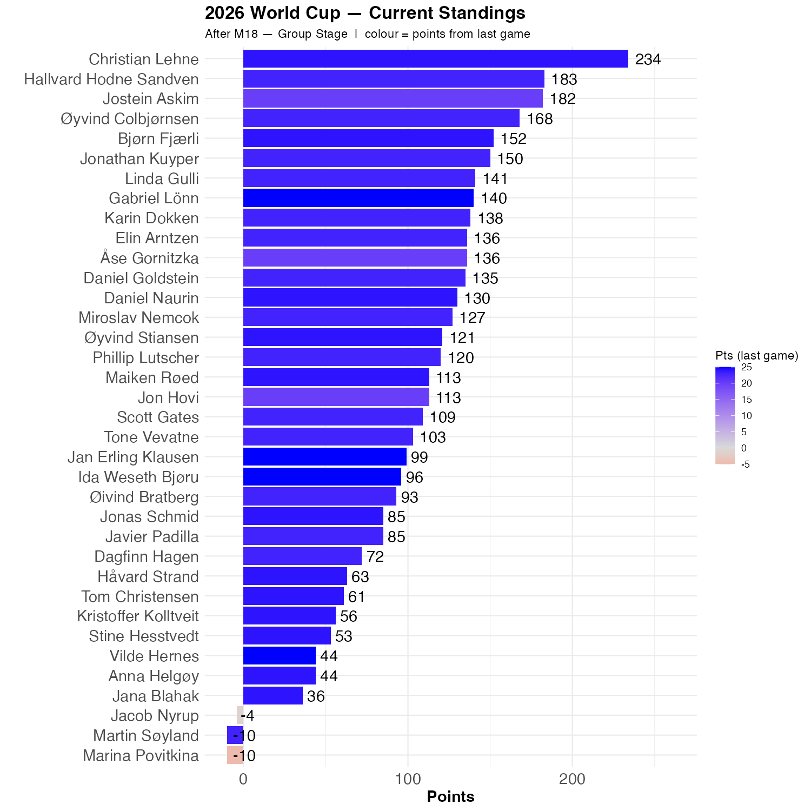

# Norway won 4-1

Norway didn't play all that well, and Iraq were impressive. But life isn't fair,

Christian got the result exactly right, as did Bjærn. The gap is now 51 points. 

```{r standings, echo=FALSE, message=FALSE, warning=FALSE}
source(here::here("R", "plot_standings.R"))
this_match <- 18
lag        <- 1
plot_standings(this_match, lag)
```


```{r show, echo=FALSE}

```
