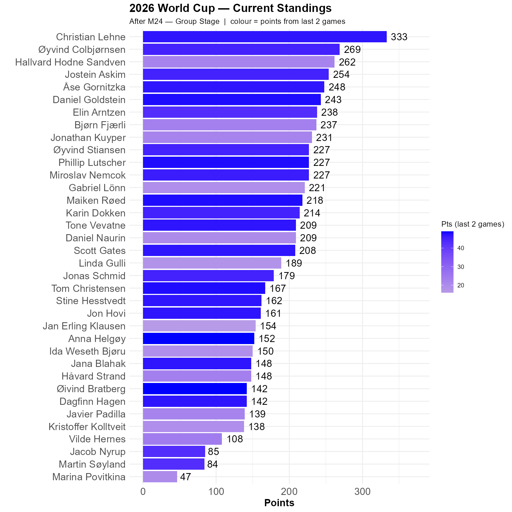

# The first round of the group stage is done

No surprises last night. Daniel got 50 points from a perfect prediction of both games, while Anna and Vilde got the 3-1 victory for Colombia. No less than seven other persons had a 1-0 victory for Ghana (Tom, Jonas, Karin, Marina, Øyvind S, Øyvind C and Øivind).

Not a lot changes in our competiton, but Hallvard lost ground. Christian's lead is now 64 points.

```{r standings, echo=FALSE, message=FALSE, warning=FALSE}
source(here::here("R", "plot_standings.R"))
this_match <- 24
lag        <- 2
plot_standings(this_match, lag)
```

```{r show, echo=FALSE}

```