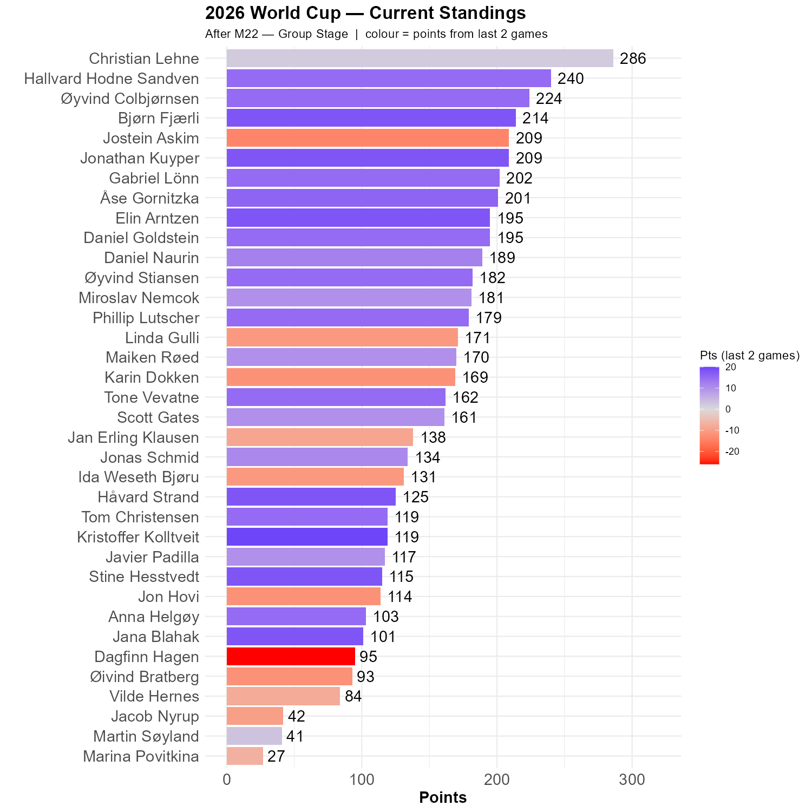

# Portugal did not win and England did not draw

We all thougth Portugal would win, which they did not. So the point collection from the first game today was limited. 

The second game was more interesting. Christian remain in the lead, but his 1-0 prediction did not contribute that many points, which means that the lead is now 46 points to Hallvard. Jostein bravely predicted a 1-1 draw, which means that he loses terrain in the top. Øyvind C is back in the race, and Jonathan did also well today.

```{r standings, echo=FALSE, message=FALSE, warning=FALSE}
source(here::here("R", "plot_standings.R"))
this_match <- 22
lag        <- 2
plot_standings(this_match, lag)
```

```{r show, echo=FALSE}

```