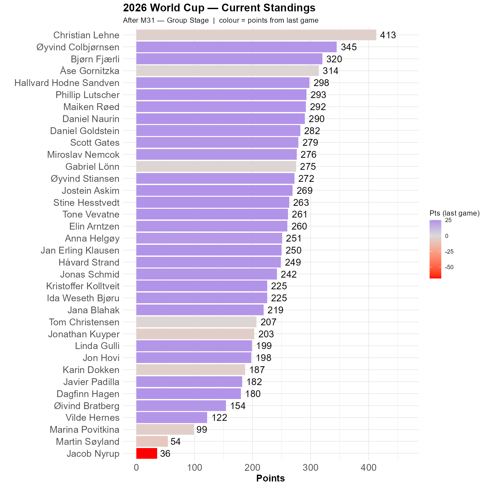

# US beat Australia

The host nation is through to the round of 32. This is the first time a host nation has progressed since yesterday. 

Many of us had the correct outcome: Jostein, Jan Erling, Kristoffer, Tone, Dagfinn, Daniel, Phillip and Stine. Another thing they have in common is that they are not Christian.

```{r standings, echo=FALSE, message=FALSE, warning=FALSE}
source(here::here("R", "plot_standings.R"))
this_match <- 31
lag        <- 1
plot_standings(this_match, lag)
```

You might ask what is wrong with the colors? Where is the deep, blue color of success? The problem here is that the scale is symmetric. The deep red color must match the deep blue. Usually not a problem, but Jacob bravely put down a 0-8 victory for Australia, netting a neat -8^2 - 2^2 = -68 points. 

Øyvind is now 68 points behind Christian. Bjørn is third, his top ranking so far.

```{r show, echo=FALSE}

```