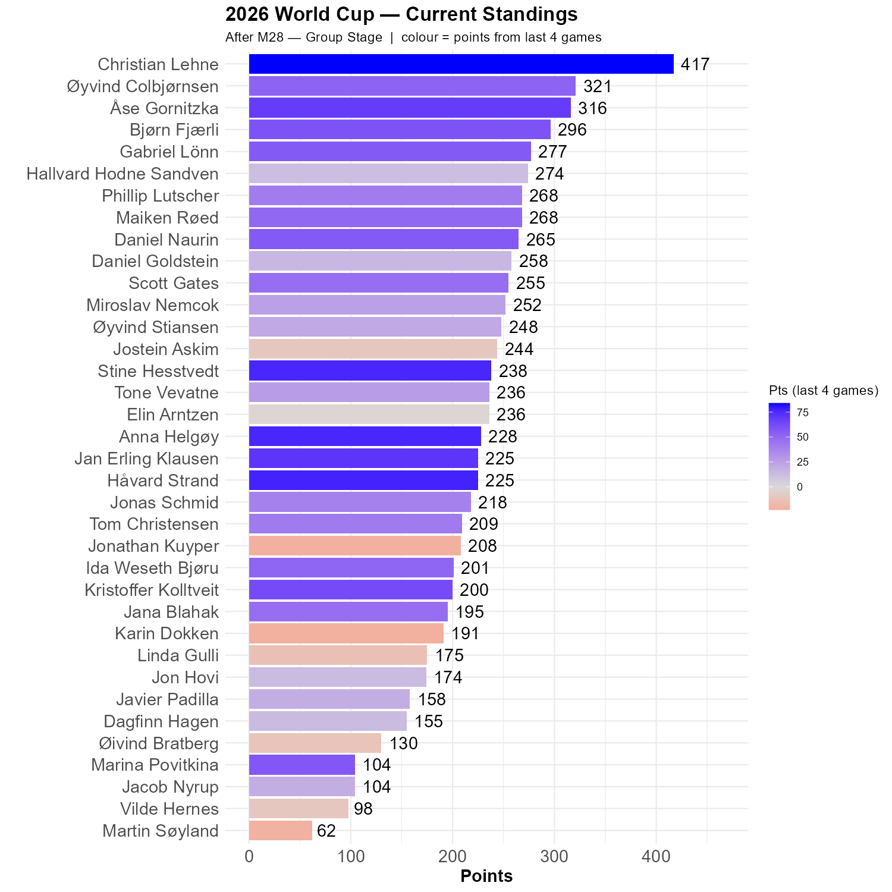

# Four more games and a runaway leader

Mexico has qualified for the round of 32, as the first host nation since Russia in 2018.

Yesterday was transformative. Four games are included in this update and Christian has built a massive gap, 96 points ahead og Øyvind C. The fact that the 2nd place rotates every update underscores the collective problem the rest of us has. While Christian keep on stockpiling results, the rest of us are inconsistent. Right now, Øyvind C. and Åse, two previous winners, are closest.

Five of us had all four games correctly predicted: Stine, Anna, Jan Erling and myself, in addition to Christian.

```{r standings, echo=FALSE, message=FALSE, warning=FALSE}
source(here::here("R", "plot_standings.R"))
this_match <- 28
lag        <- 4
plot_standings(this_match, lag)
```

```{r show, echo=FALSE}

```

The key to success was the Canada - Qatar game. The 6-0 results means that a 1-0 prediction yields 0 points, while a 3-0 prediction produces 16 points. Bjørn, Kristoffer, Gabriel, and Christian had 3 goals for Canada, and are rewarded accordingly. Predicting 0-0 in this game gives -36 points. 

```{r scatter_points, echo=FALSE, message=FALSE , warning=FALSE}
source("../../R/group_stage_scatter.R")
plot_match(27, save = TRUE) 
```