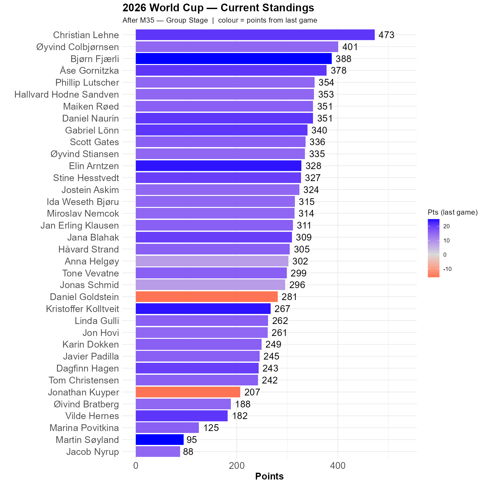

# Swedish delight turns sour

Sweden were, statistically speaking, almost certain of a place in the round of 32, but the Netherlands canceled out their goal difference, and the future looks uncertain again. However, the Swedish attackers were at times brilliant and they can still beat Japan. 

Christian increased the gap to Øyvind C, currently at 72 points, but Bjørn comes racing from behind. Bjørn and Martin are today's rockets. Both had the correct 5-1 prediction. Jacob's 8-0 prediction was not too off today, while Kristoffer and Elin were close and got 24 points each. 

```{r standings, echo=FALSE, message=FALSE, warning=FALSE}
source(here::here("R", "plot_standings.R"))
this_match <- 35
lag        <- 1
plot_standings(this_match, lag)
```

```{r show, echo=FALSE}

```

```{r scatter_points, echo=FALSE, message=FALSE , warning=FALSE}
source("../../R/group_stage_scatter.R")
plot_match(35, save = TRUE) 
```