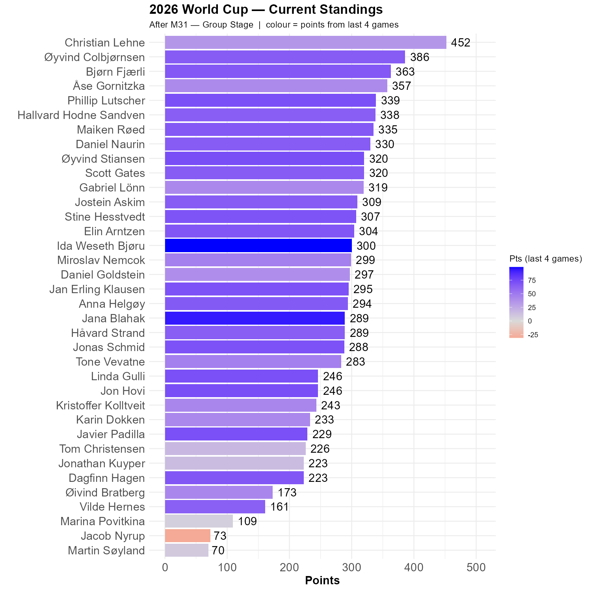

# Brazil and Morocco are through

Brazil and Morocco won their games and are through. 

Paraguay beat Turkey with 10 men for the second half, after Almiron spoke with an opponent with his hand in front of his mouth. However, Turkey are out, as the first team. 

Some of the dates of the games in the Excel form are wrong, which causes some problems. Today's update is therefore compared to the situation five games ago.

Christian is still in the lead, 66 points ahead of Øyvind. Today's rockets are Jana and Ida. Ida got all three games correct!

```{r standings, echo=FALSE, message=FALSE, warning=FALSE}
source(here::here("R", "plot_standings.R"))
this_match <- 31
lag        <- 4
plot_standings(this_match, lag)
```

```{r show, echo=FALSE}

```