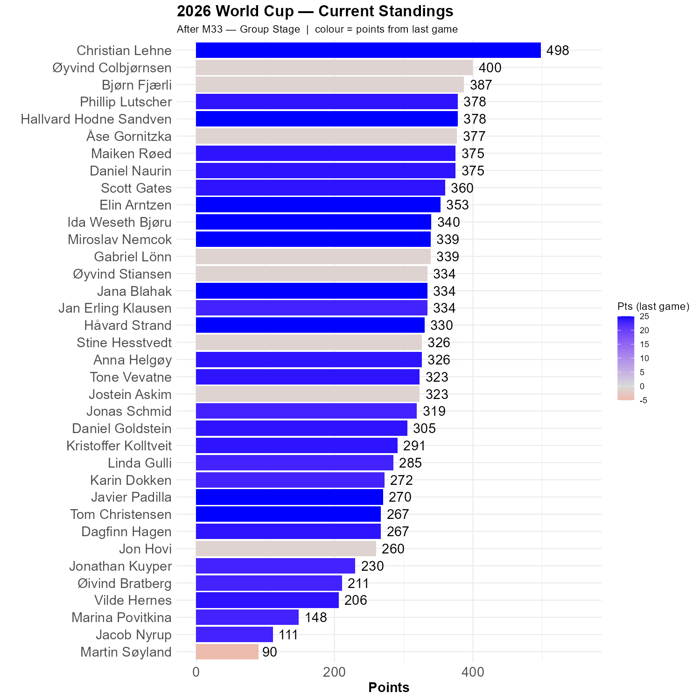

# What a game!

Ivory Coast outplayed Germany at times, but in the end Deniz Undav's two goals proved decisive. But the game was a proper world cup classic, and if Norway ends up in second spot in our group, we play the second best team from this group. Against whom we will lose. It is much better to go through as the 3rd team and meet for instance the winner of group B, which is either Canada or Switzerland.

Tom, Ida, Elin, Hallvard, Christian, Håvard, Jana, Javier and Miroslav had the correct outcome, and most others were fairly close. Øyvind C and Bjørn were not among these others, so Christian's lead is now 98 points.

```{r standings, echo=FALSE, message=FALSE, warning=FALSE}
source(here::here("R", "plot_standings.R"))
this_match <- 33
lag        <- 1
plot_standings(this_match, lag)
```

```{r show, echo=FALSE}

```

```{r scatter_points, echo=FALSE, message=FALSE , warning=FALSE}
source("../../R/group_stage_scatter.R")
plot_match(33, save = TRUE) 
```