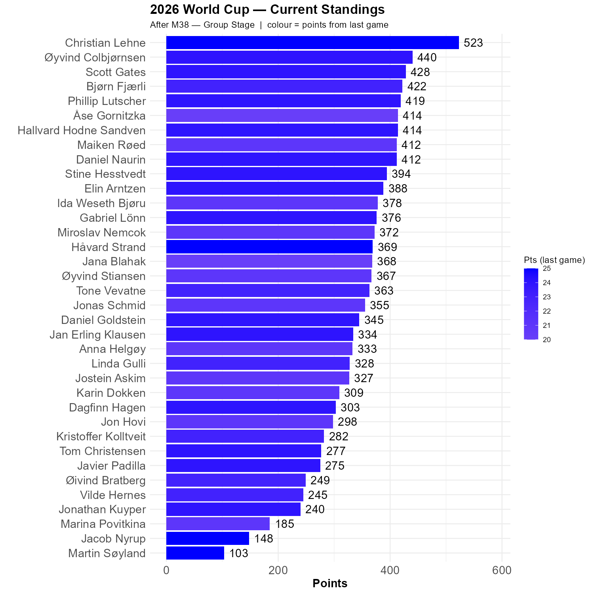

# Spain beats Saudi-Arabia properly.

In a world cup with many uninteresting games that has turned interesting, not least because of Spain, it is reassuring to find an uninteresting uninteresting game. Which this was. We all thought this would happen, but disagreed on the score.

Four of us had the correct score. Christian is joined Martin, Jacob and myself. But we all got between 20 and 25 points, so this game changes very little.

Christian is 83 points ahead of Øyvind. 

```{r standings, echo=FALSE, message=FALSE, warning=FALSE}
source(here::here("R", "plot_standings.R"))
this_match <- 38
lag        <- 1
plot_standings(this_match, lag)
```

```{r show, echo=FALSE}

```

```{r scatter_points, echo=FALSE, message=FALSE , warning=FALSE}
source("../../R/group_stage_scatter.R")
plot_match(38, save = TRUE) 
```