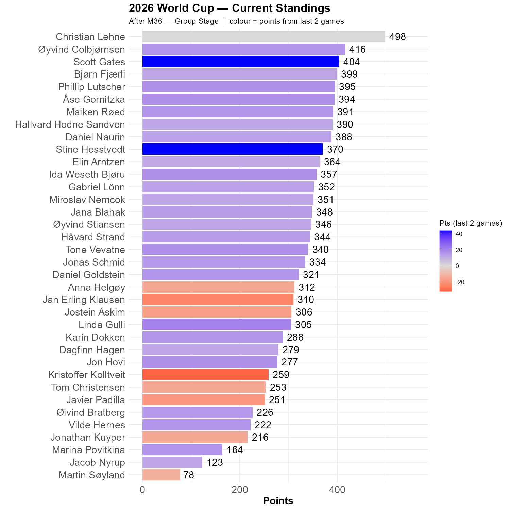

# Ecuador didn't beat Curacao

Surprisingly, Curacao held Ecuador to a draw. It is as such not impossible that Curacao makes it through to the knockout phase. But it is not likely either, as they have to beat the beautiful, impressive, massive Ivory Coast. Ecuador face Germany, and stranger things have happened.


```{r standings, echo=FALSE, message=FALSE, warning=FALSE}
source(here::here("R", "plot_standings.R"))
this_match <- 36
lag        <- 2
plot_standings(this_match, lag)
```

Christian ended up exactly where we was two games ago, and Øyvind has moved closer. The gap is now 82 points. Scott and Stine are the Rockets of the Round, blasting up the standings. Scott is now third.

```{r show, echo=FALSE}

```