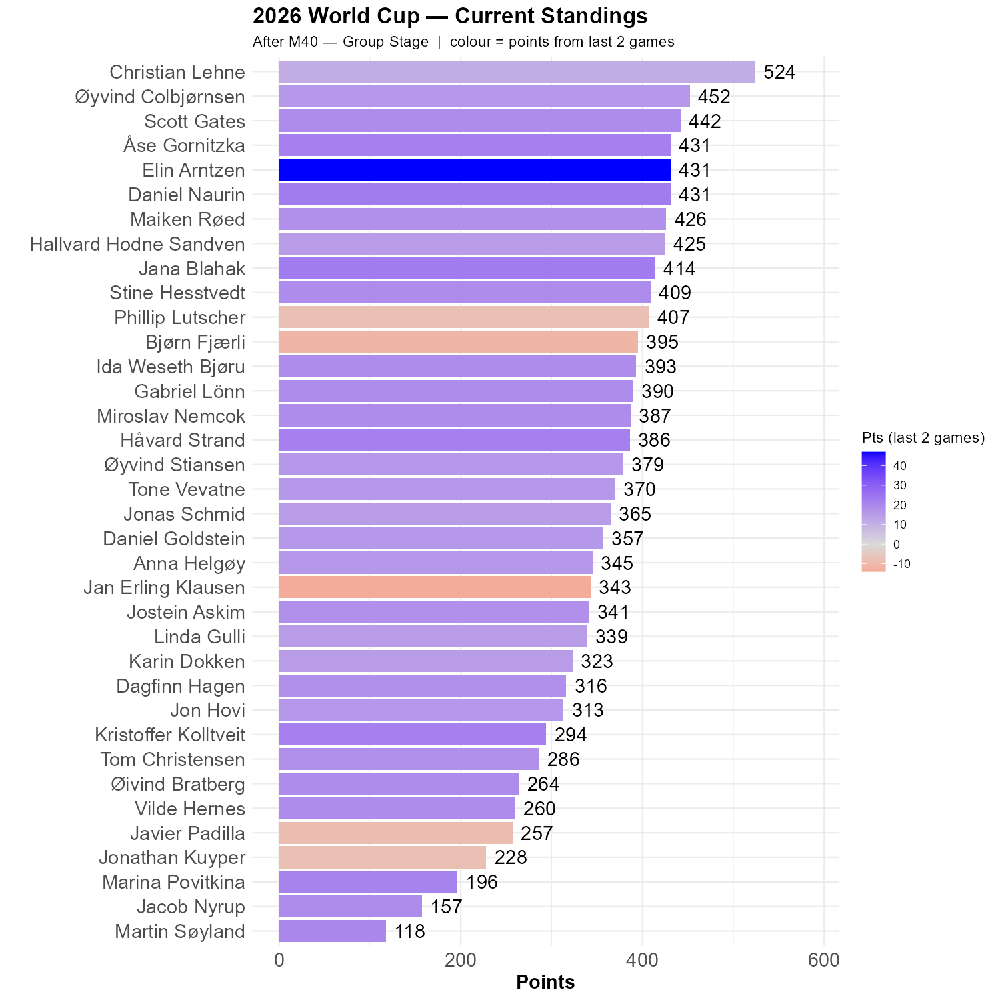

# Egypt are through and Group H is quite open

Egypt won 3-1, a result only Daniel got right. But the Rocket of the Round is Elin, who was alone in foreseeing Cabo Verde getting a point against Uruguay. 

Christian is 72 points ahead of Øyvind C.

```{r standings, echo=FALSE, message=FALSE, warning=FALSE}
source(here::here("R", "plot_standings.R"))
this_match <- 40
lag        <- 2
plot_standings(this_match, lag)
```

```{r show, echo=FALSE}

```