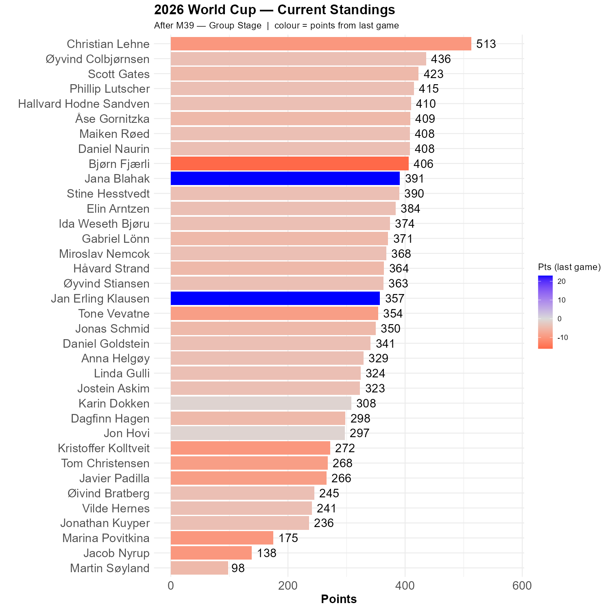

# Iran and Belgia both fail to score. 

Belgium is a disappointment so far in this championship, and today they disappointed every one of us but Jana and Jan Erling, who are Rockets of the Round!

Christian remain in front, with a 77 point lead. Jana is in the top ten!

Ngoy's red card means that the question regarding red cards is decided. We should probably phase in qualitative points fairly soon.

```{r standings, echo=FALSE, message=FALSE, warning=FALSE}
source(here::here("R", "plot_standings.R"))
this_match <- 39
lag        <- 1
plot_standings(this_match, lag)
```

```{r show, echo=FALSE}

```

```{r scatter_points, echo=FALSE, message=FALSE , warning=FALSE}
source("../../R/group_stage_scatter.R")
plot_match(39, save = TRUE) 
```