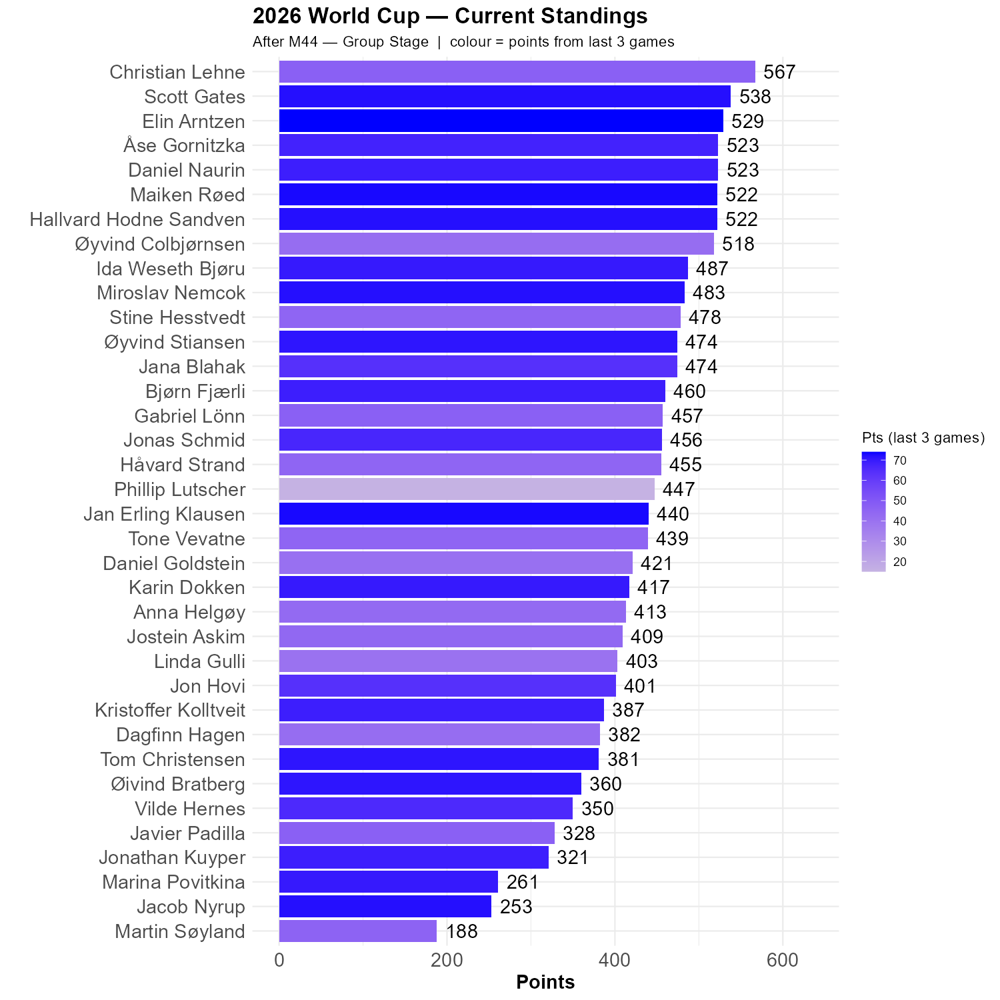

# Juhu!

Norway and France are through to the knockout stage, whereas Senegal or Iraq has to win with a margin to prevail. We all thought France would win, and 15 of us had 3-0 as the score. That other game was less uniformly predicted, but Elin and Bjørn hit the bull's eye. Interestingly, both Øyvind and Christian guestimated a draw in this match.

# Algeria beat Jordan

The 1-2 score in this game was highly anticipated, no less than 8 of us had this outcome and another 8 was one goal away. 

For our competition, this has consequences. Christian is still in the lead, but only 29 points ahead of Scott. Many of us had three correct estimates, but Elin stand out as the Rocket of the Round with 74 points out of 75 possible! 

```{r standings, echo=FALSE, message=FALSE, warning=FALSE}
source(here::here("R", "plot_standings.R"))
this_match <- 44
lag        <- 3
plot_standings(this_match, lag)
```

```{r show, echo=FALSE}

```