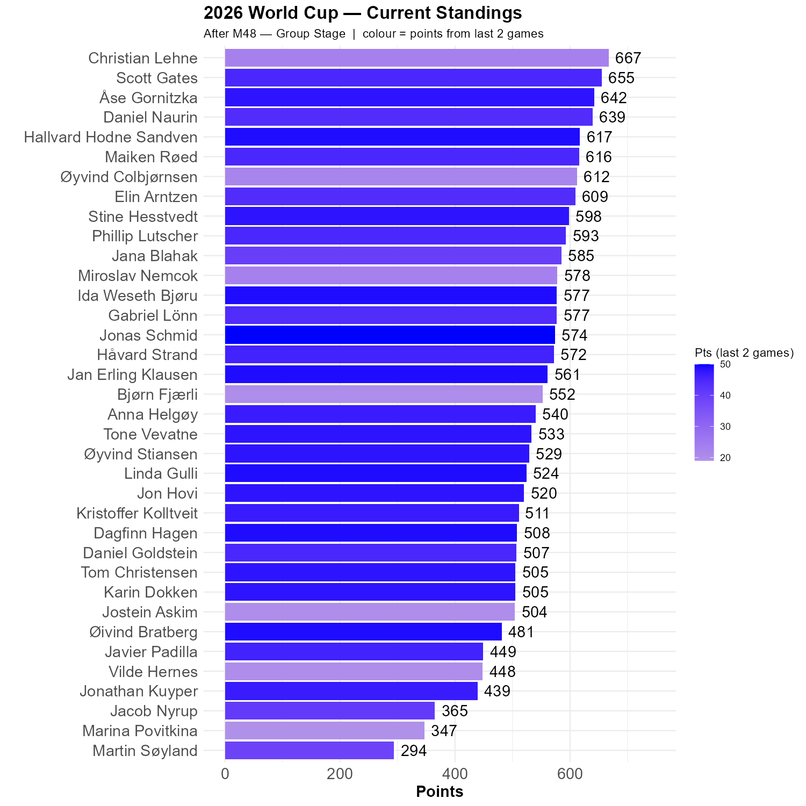

# Two narrow wins

Both games today went our way, but not in the manner we predicted. In the end, we are in a more competitive state than we have been for a while.

## Colombia vs DRC

The modal prediction was 2-0, but four of us predicted a draw. With the exception of these four, the game made very little difference in our standing

## Panama vs. Croatia

Again, all but three predicted Croatia to win. Again 2-0 was the modal prediction, but this time two front runners were among the minority. 

```{r standings, echo=FALSE, message=FALSE, warning=FALSE}
source(here::here("R", "plot_standings.R"))
this_match <- 48
lag        <- 2
plot_standings(this_match, lag)
```

Christian remain in the lead, but the distance to Scott is 12 points. Åse is within 25 points of Christian, which effectively can change in the next game. 

```{r show, echo=FALSE}

```