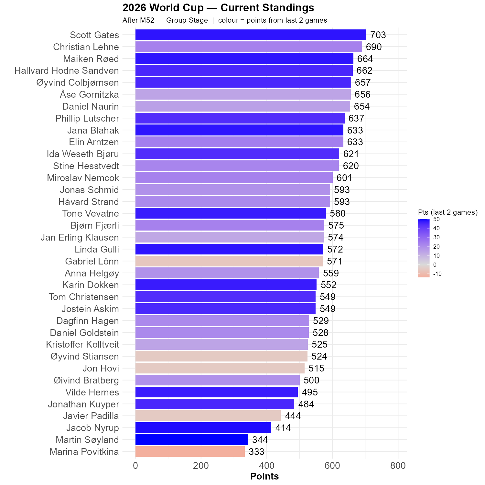

# Switzerland beat Canada

Who could have guessed? Most of us, actually, including 11 participants with the exact score. But, the same number predicted a draw, so this game rattles the ranks.

#Bosnia-Hertzegovina beat Qatar

A confident 3-1 victory brings Bosnia-Hertzegovina to 4 points and a fairly certain place in the next phase. The exact score this time was only predicted by Jacob, Elin and Martin. As Martin had the correct score in both games he is the Rocket of the Round!

#We have a new leader!

Scott got 48 out of 50 points, and is our new leader, 13 points ahead of Christian who has been in front 
for 40 games -- since Sweden beat Tunisia 5-1. Maiken, Åse, Hallvard, Øyvind C. and Daniel N. chase the duo in front with about 40 points. This remains wide open!


```{r standings, echo=FALSE, message=FALSE, warning=FALSE}
source(here::here("R", "plot_standings.R"))
this_match <- 52
lag        <- 2
plot_standings(this_match, lag)
gapdata <- plot_standings_return(this_match, lag)
```


```{r show, echo=FALSE}

```