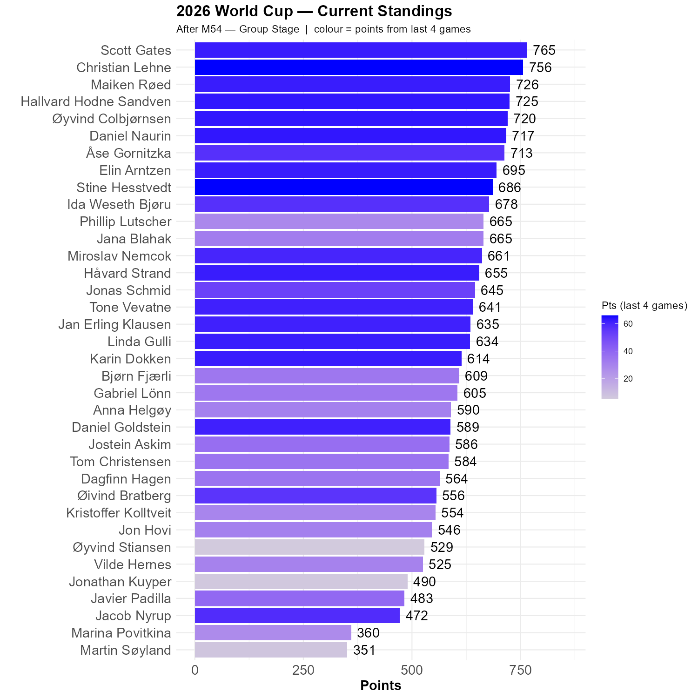

# South Africa progresses from group A

The World Cup started in the worst possible way for South Africa, but last night they made up for it with a historic win over South Korea. As Mexico rolled over Czechia, South Korea remain in third and are very likely to survive.

## Marocco and Brasil top group B

Haiti made a brave stand, but are out with three losses and zero points. Scotland is currently 7th in the table of the thirds, which is not as dire as it might sound. Several of the teams above have a splendid opportunity to worsen their goal difference in their last game. 

## The standings

Scott remain leader, 9 points ahead of Christian, who shared the Rocket of the Round medal with Stine. Both had 66 points out of 100. The stumbling block was South Africa - South Korea, which Marina got exactly right, and where Øivind predicted the correct result.


```{r standings, echo=FALSE, message=FALSE, warning=FALSE}
source(here::here("R", "plot_standings.R"))
this_match <- 54
lag        <- 4
plot_standings(this_match, lag)
gapdata <- plot_standings_return(this_match, lag)
```


```{r show, echo=FALSE}

```