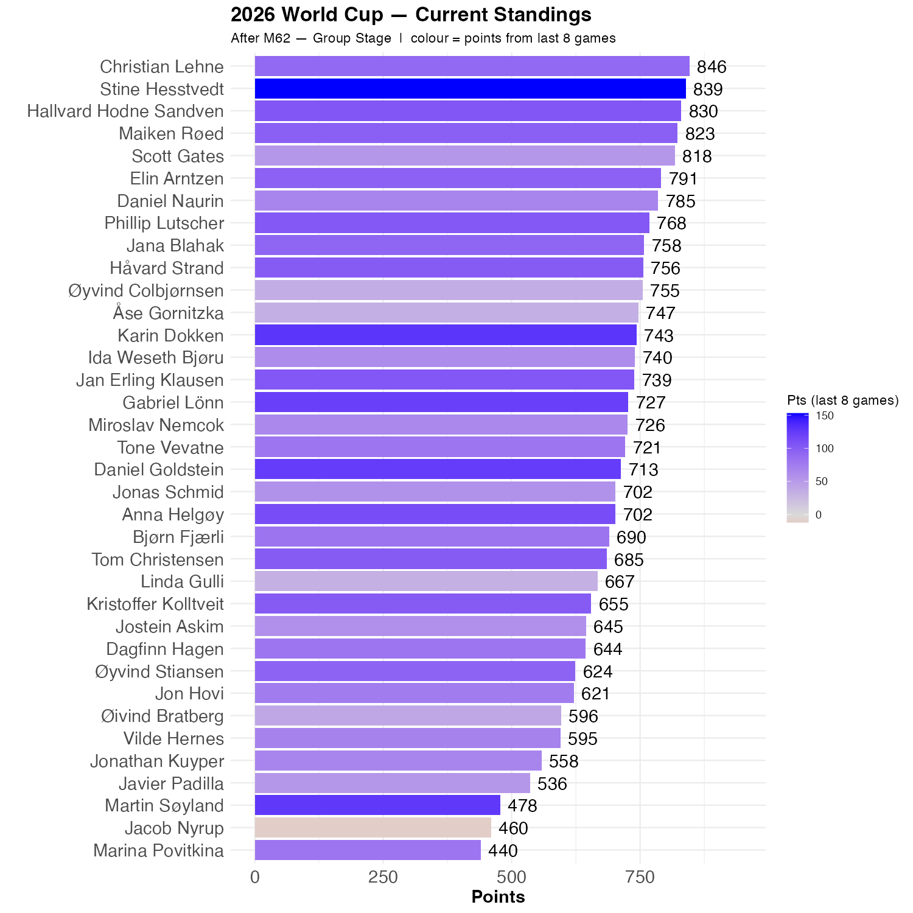

```{r standings, echo=FALSE, message=FALSE, warning=FALSE}
source(here::here("R", "plot_standings.R"))
this_match <- 62
lag        <- 8
plot_standings(this_match, lag)
gapdata <- plot_standings_return(this_match, lag)
```

Eight games have been played since the last update. Scott, the previous leader is now in fifth, but only 28 points behind Christian. However, Stine has had a tremendous spell and is now just 7 points behind Christian. 

Stine and Martin are the Rockets of the Round.

```{r show, echo=FALSE}

```