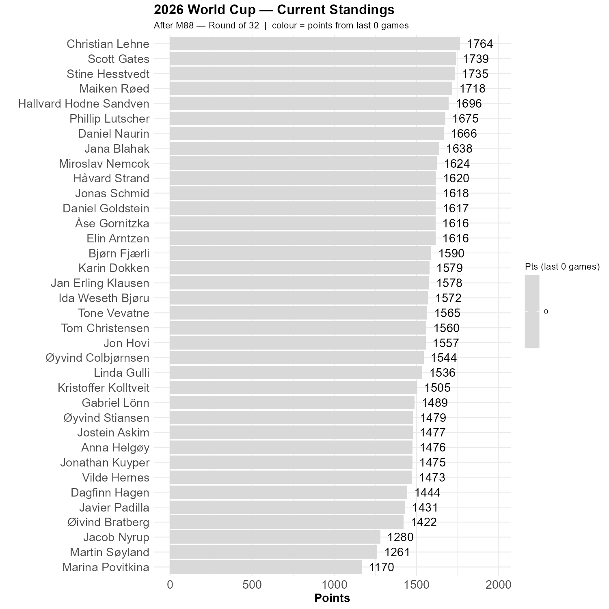

# Claude could do better

I had hopes that Claude could let us see the scores increase as the teams in the knockout stage were confirmed, but oh no. 

Therefore, this update is massive.

```{r standings, echo=FALSE, message=FALSE, warning=FALSE}
source(here::here("R", "plot_standings.R"))
this_match <- 88
lag        <- 0
plot_standings(this_match, lag)
gapdata <- plot_standings_return(this_match, lag)
```

There was no point in adding colors to this one. 

Christian is in the lead, but things can change quickly from now on.

```{r show, echo=FALSE}

```