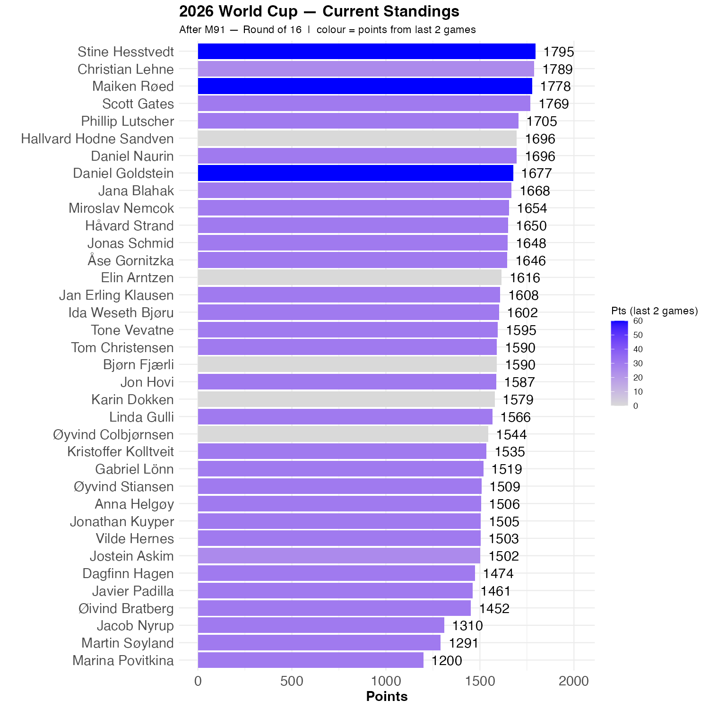

# Brasil and Canada won


```{r standings, echo=FALSE, message=FALSE, warning=FALSE}
source(here::here("R", "plot_standings.R"))
this_match <- 91
lag        <- 2
plot_standings(this_match, lag)
gapdata <- plot_standings_return(this_match, lag)
```

Brasil was largely anticipated to make it to the round of 16, but Canada was more of a surprise. Daniel G, Stine and Maiken had both, and Stine is now ahead of Christian, with Maiken in third. Scott is within a game as well.

```{r show, echo=FALSE}

```