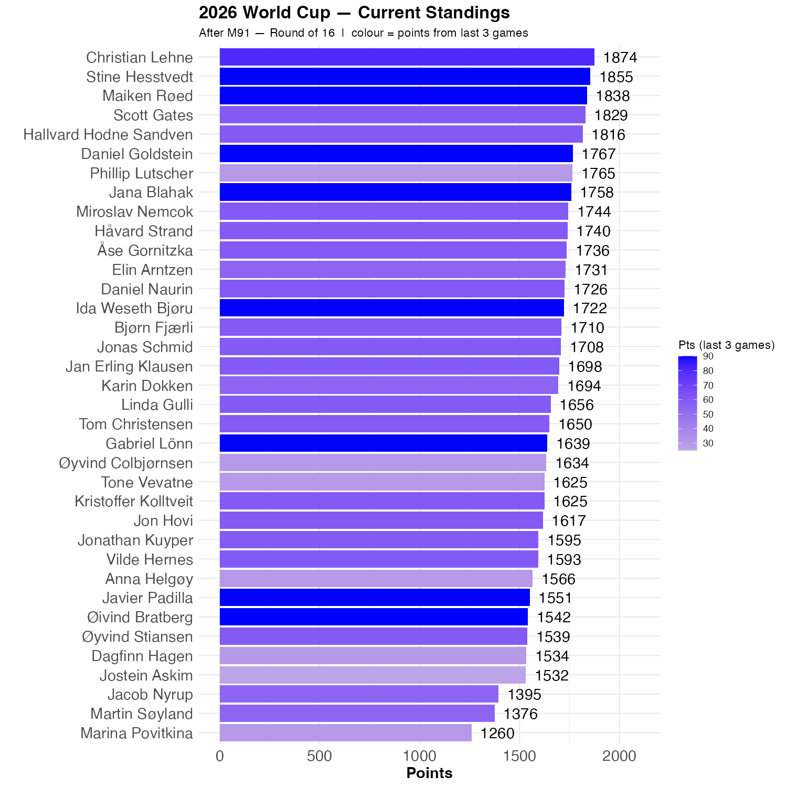

# Germany and the Netherlands are out

That was a bit of a surprise

# Norway is in the round of 16

As we were in 1998. We all know how that went. 

# Two more qualitative questions are ripe

New Zealand got one point, as did Curaco. Haiti got 0. New Zealand's goal difference is -6, whereas Curacao had -8, so New Zealand did best among the worst ranked teams.

Nusa scored. That kind of settled that. 


```{r standings, echo=FALSE, message=FALSE, warning=FALSE}
source(here::here("R", "plot_standings.R"))
this_match <- 91
lag        <- 3
plot_standings(this_match, lag)
gapdata <- plot_standings_return(this_match, lag)
```

Stine and Maiken did well, but Christian got points from New Zealand, and is back in the lead. He is 19 points ahead of Stine and 36 point ahead of Maiken. Scott and Hallvard are just behind Maiken.

```{r show, echo=FALSE}

```

