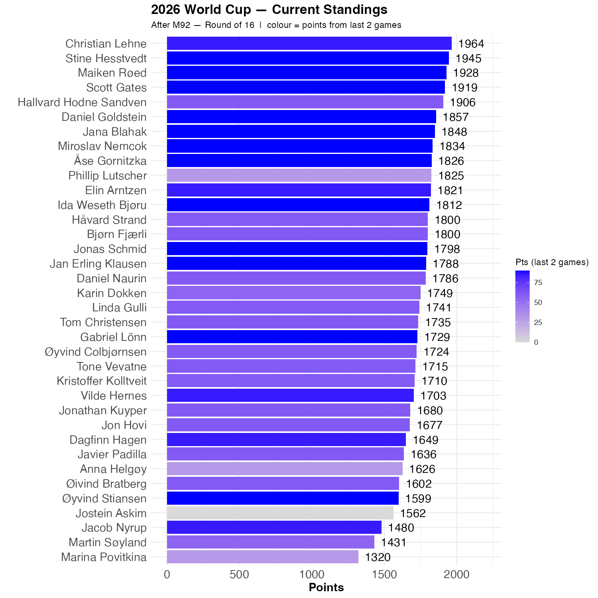

# Sweden is out

Which answers one of our questions, and points are distributed.

The coloring of the graph is a bit off, but the standings haven't changed very much.

```{r standings, echo=FALSE, message=FALSE, warning=FALSE}
source(here::here("R", "plot_standings.R"))
this_match <- 92
lag        <- 2
plot_standings(this_match, lag)
gapdata <- plot_standings_return(this_match, lag)
```


```{r show, echo=FALSE}

```