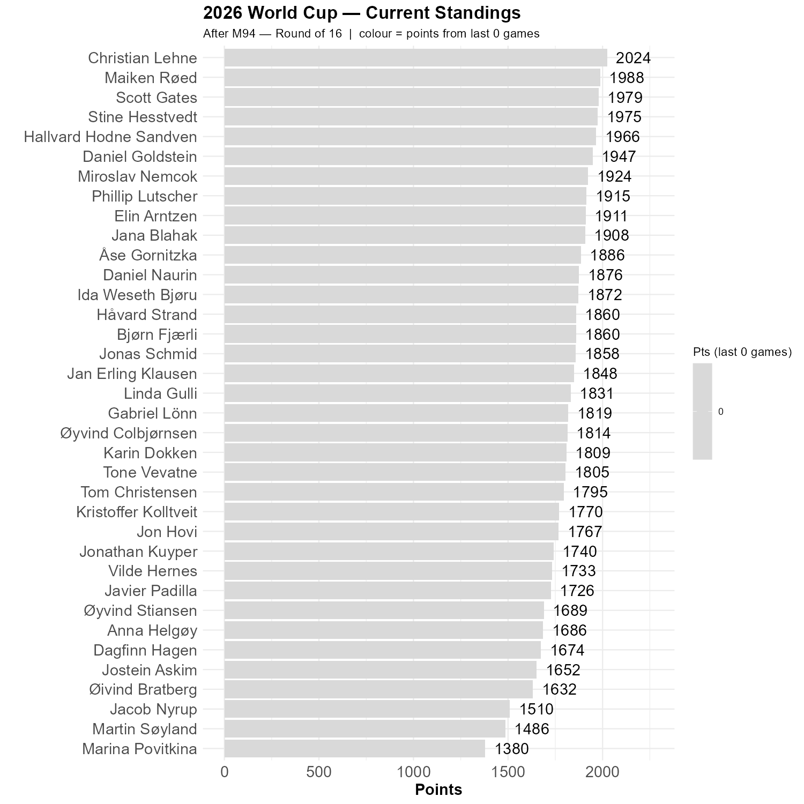

# UN Security Council permanent member show strength

Linda helped me realize that the coloring system is totally wrong, so we drop that for now. 

Christian did well last night and has a 36 point gap down to Maiken, with Scott and Stine right behind.

```{r standings, echo=FALSE, message=FALSE, warning=FALSE}
source(here::here("R", "plot_standings.R"))
this_match <- 94
lag        <- 0
plot_standings(this_match, lag)
gapdata <- plot_standings_return(this_match, lag)
```


```{r show, echo=FALSE}

```