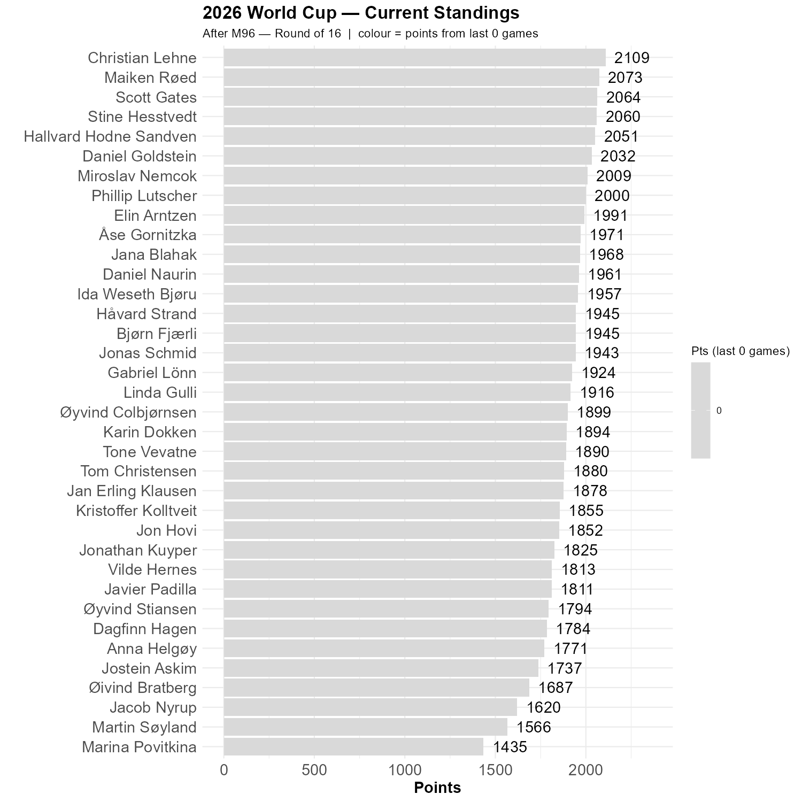

# Status Quo

We were not surprised to see Spain go through. The standings change very little. It is soon about time to start adding points for goals.

```{r standings, echo=FALSE, message=FALSE, warning=FALSE}
source(here::here("R", "plot_standings.R"))
this_match <- 96
lag        <- 0
plot_standings(this_match, lag)
gapdata <- plot_standings_return(this_match, lag)
```


```{r show, echo=FALSE}

```