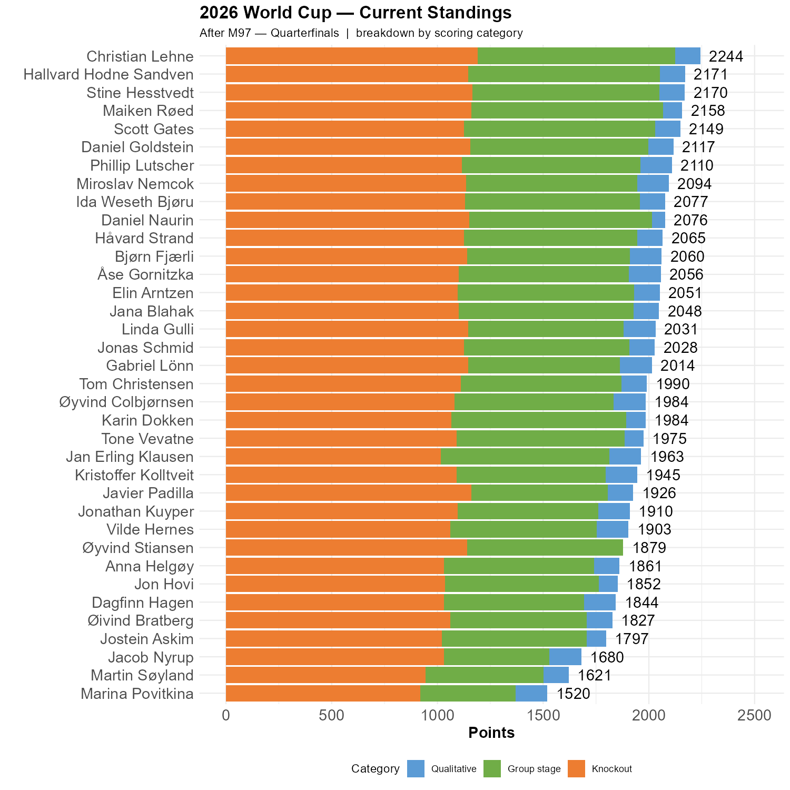

```{r standings, echo=FALSE, message=FALSE, warning=FALSE}
source(here::here("R", "plot_standings.R"))
this_match <- 97
lag        <- 0
#plot_standings(this_match, lag)
gapdata <- plot_standings_stacked(this_match)

source(here::here("R", "ko_bracket.R"))
#plot_ko_bracket()                   # display
#plot_ko_bracket(save = TRUE)        # save to img/ko_bracket.png

```
Morocco and France meet in the first quarter-final. This was correctly predicted by Bjørn, Daniel N., Gabriel, Hallvard, myself, Ida, Javier and Øivind. Most of us had France in this match.


Christian is now 73 points ahead of Hallvard and 74 points ahead of Stine, with Maiken & Scott in pursuit. This might look like a lot, but it isn't necessarily so. 

The graph below shows that Christian has gained most points from the knockout stages so far, but this can easily change.


```{r show, echo=FALSE}

```