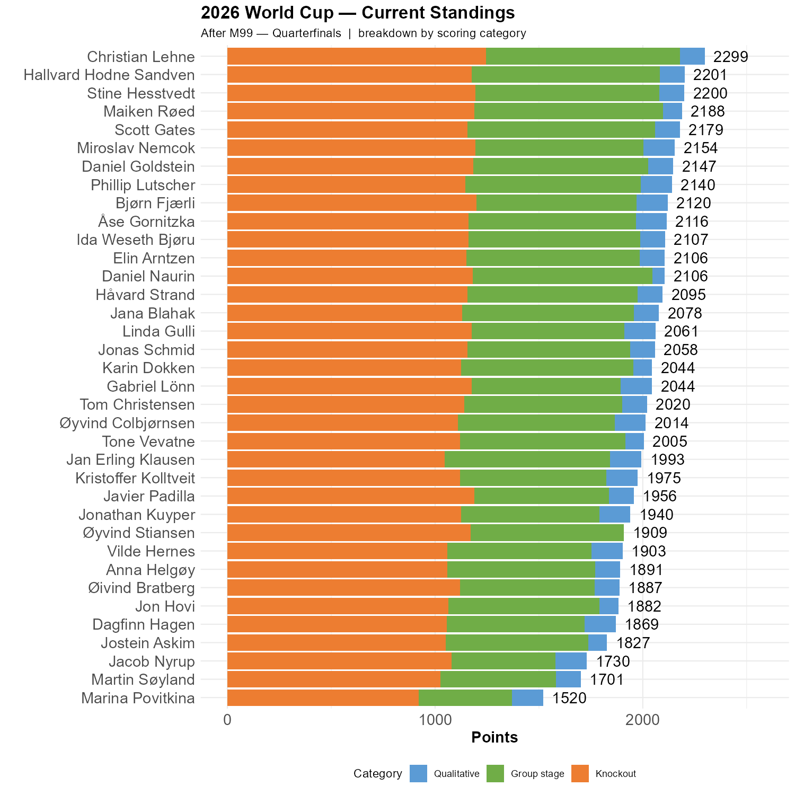

# Juhu!

Perhaps not the best game ever, but Wow! And among us are two prophets: Bjørn and Øyvind have both predicted four out of four quarterfinalists so far. 

```{r standings, echo=FALSE, message=FALSE, warning=FALSE}
source(here::here("R", "plot_standings.R"))
this_match <- 99
lag        <- 0
plot_standings_stacked(this_match)
gapdata <- plot_standings_return(this_match, lag)
```

Christian is now 98 points ahead of Hallvard, with Stine a point behind. But we should keep in mind that predicting the winner is worth 200 points. 12 participants are within 200 points of Christian. Hallvard has Spain and Stine, Maiken & Scott has France as winner.  


```{r show, echo=FALSE}

```
Christian remains on top of the knockout table, but Bjørn and Miroslav made tremendous progress yesterday. 

```{r}
#| fig.height: 7
source(here::here("R", "ko_bracket.R"))
plot_ko_bracket() 

```