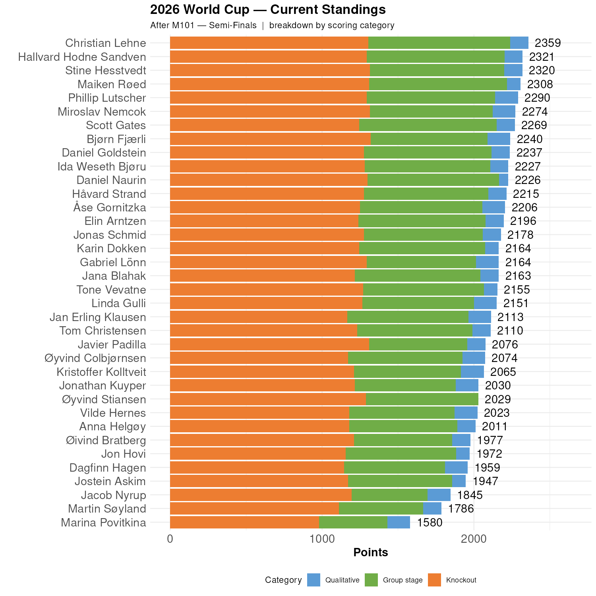

# No broadband in the mountains

I've been off line for a few days, so this update is late.

#

```{r standings, echo=FALSE, message=FALSE, warning=FALSE}
source(here::here("R", "plot_standings.R"))
this_match <- 101
lag        <- 0
plot_standings_stacked(this_match)
gapdata <- plot_standings_return(this_match, lag)
```

Christian remain in the lead, but Hallvard, Stine and Maiken are very close behind, 38, 39 and 51 points respectively. 

```{r show, echo=FALSE}

```
The knockout table has changed a lot since the last update. Bjørn tops the leaderboard with a stunning 7 out of 8 correct for the Quarter finals. Miroslav is second with 6 of 8. Stine, Javier and Maiken are all ahead of Christian, which means that the standings can change quickly.
```{r ko-bracket}
#| fig.height: 7
#| echo: false
#| message: false
#| warning: false
source(here::here("R", "ko_bracket.R"))
plot_ko_bracket()

```