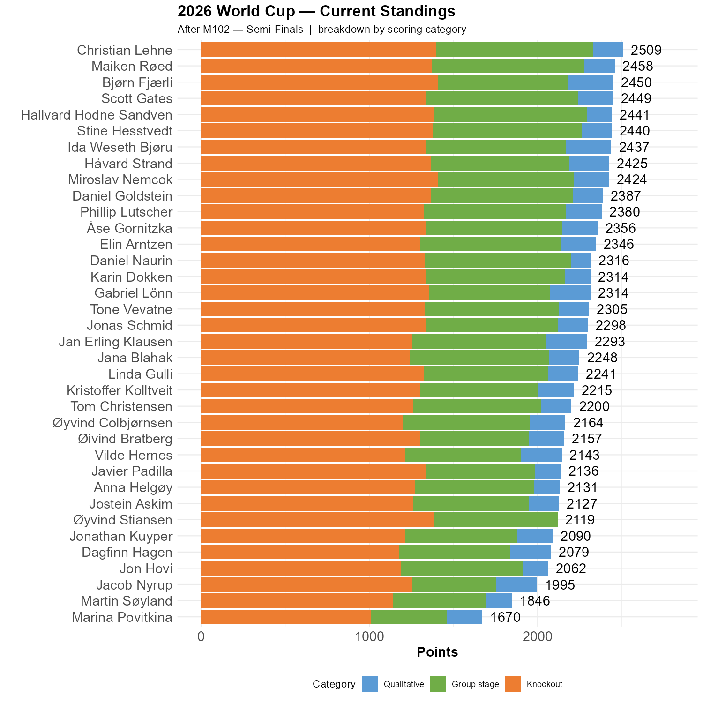

# And Norway is out

Oh well. It was fun.  

```{r standings, echo=FALSE, message=FALSE, warning=FALSE}
source(here::here("R", "plot_standings.R"))
this_match <- 102
lag        <- 0
plot_standings_stacked(this_match)
gapdata <- plot_standings_return(this_match, lag)
```

Christian is 51 points ahead of Maiken and, 59 points ahead of Bjørn, 60 points ahead of Scott, with Hallvard, Stine and Ida right behind. 

```{r show, echo=FALSE}

```
# A tremendous amount of points

Norway's exit triggers the conclusion to several of the questions in the survey. Ida and Bjørn have 7 correct answers so far, while 6 players have 6 correct answers. There are 7 questions left.

## How many goals did Haaland score?

The answer is seven. Ida, Vilde and Bjørn knew that.

```{r q_haaland, echo=FALSE, message=FALSE, warning=FALSE}
library(jsonlite)
library(tidyverse)
library(here)

# Read the qualitative.json file
qual_raw <- fromJSON(here("gData", "qualitative.json"), simplifyVector = FALSE)

# Helper: force any field to a single scalar (NA if NULL/empty, first value if too long)
to_scalar <- function(x) {
  if (is.null(x) || length(x) == 0) return(NA)
  if (length(x) > 1) return(paste(unlist(x), collapse = "; "))
  if (is.list(x)) return(unlist(x)[1])
  x
}

# Build each row safely, then bind
responses_df <- map_dfr(qual_raw$responses, function(r) {
  r_scalar <- map(r, to_scalar)
  as_tibble(r_scalar)
})

library(ggplot2)
library(scales)

responses_df <- responses_df %>%
  mutate(
    haaland_goals_num = as.numeric(haaland_goals),
    is_correct = haaland_goals_num == 7
  )

ggplot(responses_df, aes(x = haaland_goals_num, fill = is_correct)) +
  geom_histogram(binwidth = 1, boundary = -0.5, color = "white") +
  scale_x_continuous(breaks = breaks_width(1)) +
  scale_y_continuous(breaks = breaks_width(1)) +
  scale_fill_manual(values = c(`FALSE` = "steelblue", `TRUE` = "firebrick"),
                     guide = "none") +
  labs(
    title = "Predicted number of Haaland goals",
    subtitle = "Correct answer (7) highlighted in red",
    x = "Haaland goals",
    y = "Number of participants"
  ) +
  theme_minimal(base_size = 13)


```

## Norway's top assister

No less than 20 of us had Ødegaard, so a lot of points were earned here.

```{r q_assist, echo=FALSE, message=FALSE, warning=FALSE}

library(forcats)

responses_df %>%
  filter(!is.na(norway_top_assister)) %>%
  mutate(
    norway_top_assister = fct_infreq(norway_top_assister),
    is_correct = norway_top_assister == "Martin Ødegaard"
  ) %>%
  ggplot(aes(x = norway_top_assister, fill = is_correct)) +
  geom_bar(color = "white") +
  scale_y_continuous(breaks = function(x) seq(0, ceiling(max(x)), by = 1),
                      limits = c(0, NA)) +
  scale_fill_manual(values = c(`FALSE` = "steelblue", `TRUE` = "firebrick"),
                     guide = "none") +
  coord_flip() +
  labs(
    title = "Predicted top Norwegian assister",
    subtitle = "Correct answer (Martin Ødegaard) highlighted in red",
    x = "Player",
    y = "Number of participants"
  ) +
  theme_minimal(base_size = 13)

```

## No penalties for Haaland

Jostein, Dagfinn, Jana, Jonas, Ida, Marina and myself had the correct answer out of the two possible. 

## VAR came and took away our goal

No less than 22 of us thought that VAR would do this, but perhaps not in the shape of the retake of a corner.

## No red cards

33 of us got this correct, which effectively changes very little.


