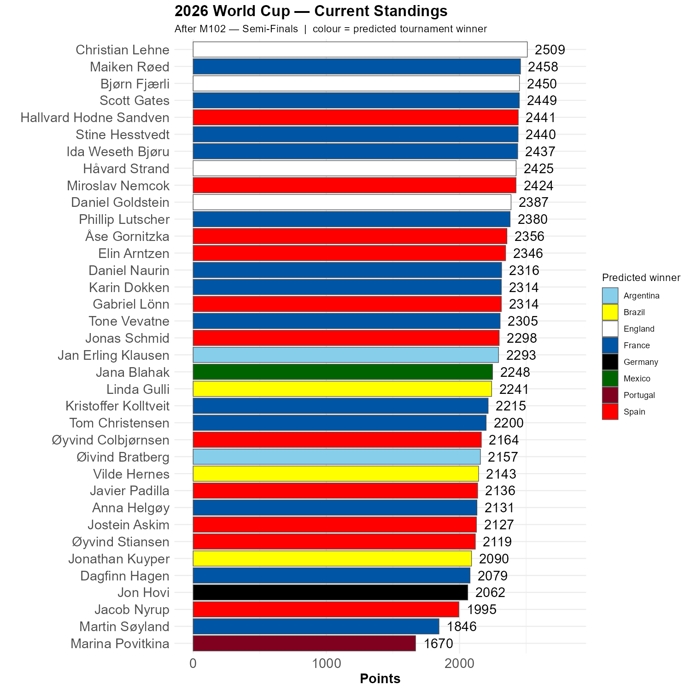

# There are four potential winners

The 200 points that are awarded for getting the winner right is usually determining the winner of our competition. Christian, who is in the lead and has been for a while, is quite likely the winner if England wins. Hallvard is ahead in the Spanish camp, but Miroslav is very, very close. Maiken is leading Scott by 9 points, and this will be extremely close if France wins the final. Stine and Ida are also right behind. Finally, Jan Erling is more than 200 points behind Christian, so if Argentina wins, it is quite open who will win the competition. 

```{r standings, echo=FALSE, message=FALSE, warning=FALSE}
source(here::here("R", "plot_standings.R"))
this_match <- 102
lag        <- 0
plot_standings_by_winner(this_match)
gapdata <- plot_standings_return(this_match, lag)
```


```{r show, echo=FALSE}

```
