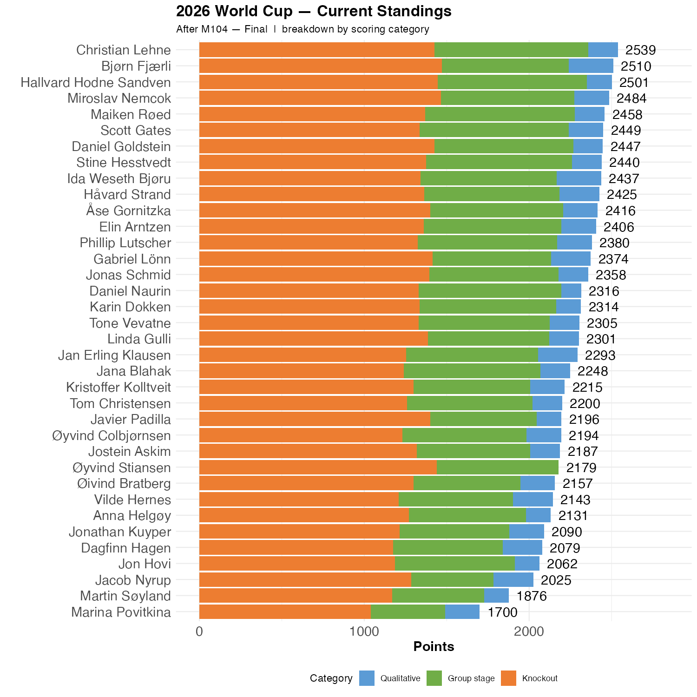

# Spain is the first finalist

12 of us have Spain as their winner, and based on the game against France, they should be favorites. 

```{r standings, echo=FALSE, message=FALSE, warning=FALSE}
source(here::here("R", "plot_standings.R"))
this_match <- 104
lag        <- 0
plot_standings_stacked(this_match)
gapdata <- plot_standings_return(this_match, lag)
```

Christian remain ahead, but the gap to Bjørn is now only 29 points. Hallvard is only 38 points behind. 

There are three games left.

```{r show, echo=FALSE}

```
Christian remains on top of the knockout table, but Bjørn and Miroslav made tremendous progress yesterday. 
