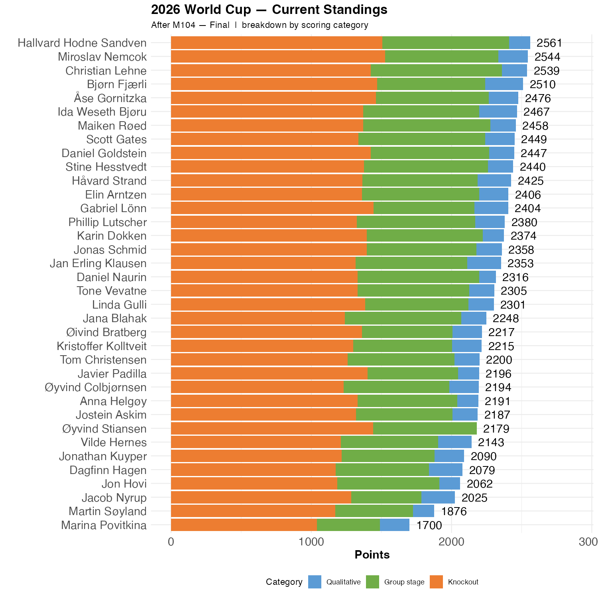

# Argentina beats England

A massive, if not always well-played game. It is somewhat surprising that there were no red cards in this game.

We have plenty of points to dish out, and we have a cliffhanger going towards the last two games. 
 
Hallvard is, right now, the leader of our competition, barely in front of Miroslav (17 points) and Christian (22 points). Bjørn is 51 points behind, and 19 points behind Christian. The latter might turn out to be important.

Both Miroslav and Hallvard have Spain as winner, Argentina as runner-up and France as winner of the Bronze final. The last two games will not differ between them. 

```{r standings, echo=FALSE, message=FALSE, warning=FALSE}
source(here::here("R", "plot_standings.R"))
this_match <- 104
lag        <- 0
plot_standings_stacked(this_match)
gapdata <- plot_standings_return(this_match, lag)
```


```{r show, echo=FALSE}

```

## Qualitative questions

However, the qualitative questions and the total sum of goals can make a difference. A grand total of 210 points remain. 

There are currently 297 goals scored in this World Cup. Jana remain top of this table, and while Daniel G. has an impressive second spot, Christian's 26 points might turn out to be decisive, as Hallvard and Miroslav only have 3 and 4 points each. The difference is 23 and 22 points

Hallvard currently lead Christian by 22 points, but Chistian is currently set to receive 23 points more from the goal estimation.

Hence, we might say that Christian lead the competition by **one** point. If Argentina and England win the next two games, the number of goals scored might decide the outcome of our competition. 

```{r goals, echo=FALSE, message=FALSE, warning=FALSE}
library(gt)
source(here::here("R", "goals_progress_points.R"))
estimates <- goals_progress_points(this_match = 102) 
estimates |>
  gt() |>
  cols_label(
    player          = "Participant",
    gjett_underveis = "Predicted",
    fasit_underveis = "Actual",
    poeng           = "Points"
  ) |>
  fmt_number(columns = c(gjett_underveis, fasit_underveis, poeng), decimals = 0) |>
  data_color(
    columns = poeng,
    colors  = scales::col_numeric(palette = c("white", "steelblue"), domain = NULL)
  ) |>
  tab_header(title = "Cumulative Goals — Predicted vs Actual") |>
  tab_options(table.width = pct(80))
```
## Or maybe not?

The 180 points from the remaining 6 questions could make the goal difference irrelevant. 
