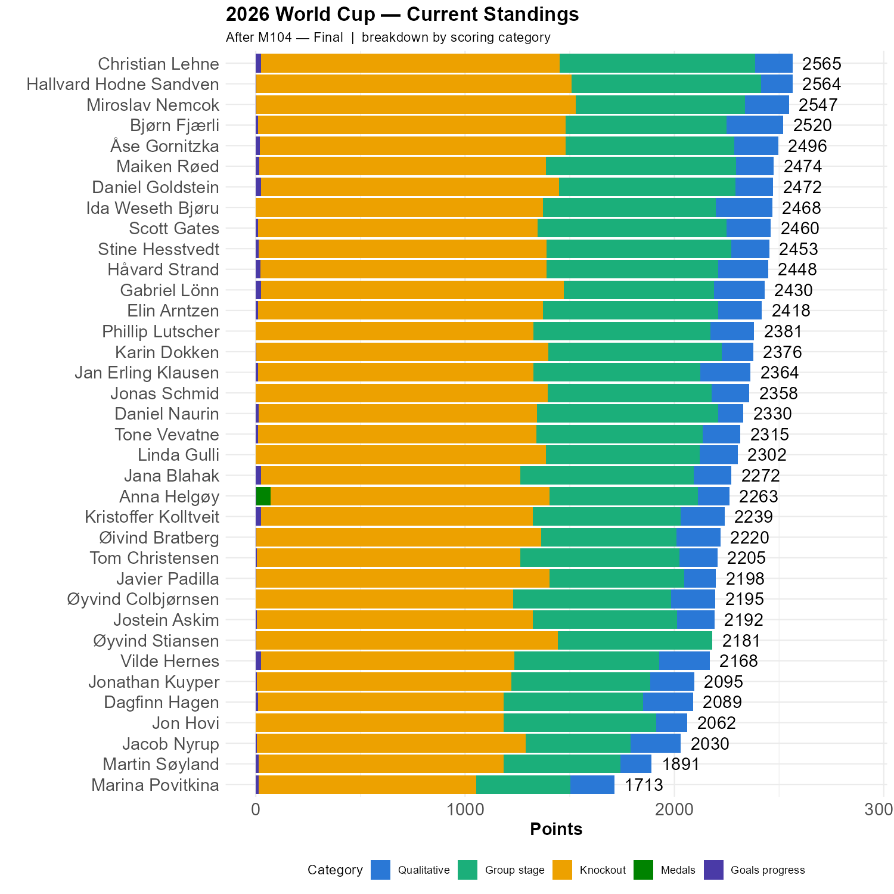

# England - France: 6 - 4. 

They didn't care, it seemed. 

Anna, alone, predicted England as the Bronze winner, and receives her 70 points. Well done!

```{r standings, echo=FALSE, message=FALSE, warning=FALSE}
source(here::here("R", "plot_standings.R"))
this_match <- 104
lag        <- 0
plot_standings_stacked(this_match)
gapdata <- plot_standings_return(this_match, lag)
```

This is the current state of our competition. Christian is **one** point ahead of Hallvard, and 18 points ahead of Miroslav. Bjørn is 45 points behind. 

A Quick breakdown of the colors. Green is points from the group stage. Yellow is points from the knockout stage. Blue is points from the qualitative questions, and dark blue is the distribution of points from the question "How many goals will there be?" This is highlighted, as it is an estimate and subject to change based on the score tonight. Dark green is the 70 points awarded to Anna for the correct winner of the bronze final. 

```{r show, echo=FALSE}

```
# A review of the remaining questions

## Top Scorer

17 of us have Kylian Mbappé as top scorer, and the only other option in our group still possible is Yamal, but that is unlikely. Among the 17 Maiken is the top ranked.

## Most assists

Michael Olise have 7 assists, and is unlikely to be replaced on top of this list. Anna, Karin, Jan Erling, Åse, Ida & Jana are set to receive points here. Åse is currently top ranked in this group, but Jan Erling has Argentina as winner and the total sum of points here is starting to look interesting.

## Number of games with extra time

So far the number is 8. Five of us have estimated 8 games, and Tom is the highest ranked among them. If the final can be added to this tally, three of us, Elin, Linda and Øyvind C., can collect points.

## Number of penalty shootouts.

So far the number is 4. Six of us has this estimate, and Hallvard Sandven is one of them! Three of us have estimaed 5 shootouts, including both Christian and Bjørn. 

## Final penalty shootout.

Seven of us have guessed Yes, including Ida, Daniel, Stine and Elin. 

## Will Trump hand the trophy to Spain?

Eight of us answered no to this question, and among the eight are Hallvard, Maiken and Miroslav. It is entirely possible that Trump will decide our competiton after the end of the final game. 

# The final update

I'm on night watch duty tonight, so the results might have to wait until Monday afternoon.


