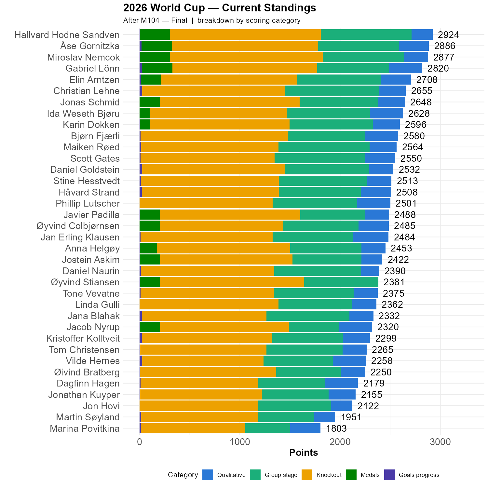

```{r standings, echo=FALSE, message=FALSE, warning=FALSE}
source(here::here("R", "plot_standings.R"))
this_match <- 104
lag        <- 0
plot_standings_stacked(this_match)
gapdata <- plot_standings_return(this_match, lag)
```

# Hallvard Hodne Sandven is the 2026 ISV Champion

Hallvard predicted the outcome of the final perfectly, and took home 300 points, enough to secure the title. 

Åse came second, by a margin of 38 points. The 2014 winner got 300 points from the final and 300 points from the qualitative questions. If the Bronze final had ended 0-0 and gone to penalties, instead of 6-4, we would have had a draw. But it didn't and we didn't and in the end it wasn't that close.

Miroslav came third, 47 points behind. He scored 1525 points in the knockout stage, and also got 300 points from the finals. However, he lost against Åse in the qualitative section and against Hallvard in the group stage. 

Congratulations to all three!

```{r show, echo=FALSE}

```

# Internal Revision

Several have voiced concern over how the points are calculated, arguing that they are somewhat difficult to understand. As a response, a video will be produced shortly to explain in detail how this has been done. A detailed report can also be requested to see one's points explained. 