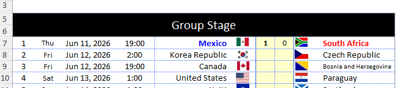
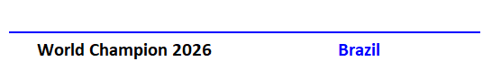

# Rules

STV’s Euro Cup competition consists of two parts:

-   14 questions related to various more or less observable topics that are found at <URL>

-   An Excel form, in which the outcome of each game has to be forecasted, estimates, guessed, place-your-verb-here. Click here to download the [Excel from.](files/world_cup_2026.xlsx)

The excel form consists of **72** games in the group stage and **32** games in the knockout stage. The schedule for the 48 group stage games is set and those games are specified on the left side of the form.

The first game is between Mexico and South Africa. There are two cells between the two countries, and we fill in what we believe is the final score. In the illustration below the score is predicted to be a victory for Mexico

We then repeat this for each game until the final game between the Czech Republic and Turkey.

When the score for all group stage games are filled in, the magic of Excel will automatically fill in the games in the Round of 32. We then move on to put in the scores in these games as well, which in turn will populate the Round of 16.

In the example above, Ivory Coast play Brazil on 29 June. There are a total of six boxes to be filled out, arranged in a 3x2 configuration. The first pais is the full time score. If this score is even, the game goes to extra time, which means that the second pair must be filled in to produce a winner. If the predictions remain even, the final pair is where the result from the penalty shootout is placed. The result here can't be even, and hence it will produce a winner.

The first and second pair will count towards the total sum of goals in the tournament, which will yield points for the best among us. The penalty shootout will not count towards this tally.

We repeat this for quarter-finals, semi-finals and, finally, the final final. When the form i successfully completed, the predicted Champion 2024 will pop up in the bottom right corner.

The form is now ready to be submitted.

## Points

-   Points are awarded for each and every correct answer to the **16** questions. In addition, we calculate the total number of goals scored in the form for a **15**th question “How many goals will there be in total? (Penalty shoot-outs excluded)”. Each of these questions yield **30** points, for a total of **510** for the questions section

-   Points are *earned* for guessing the correct outcome of each of the games in the group stage. There are 48 games in the group stage Each correct answer is worth **25** points, for a total of **1800** points

-   Points are *deducted* for any deviance between the predicted and observed scores. As usual in the Social Sciences, we square the deviance. If the first game is predicted a 2-0 Turkey victory over Italy but ends in a 4-1 Turkish victory, then 25 points are awarded for the correct outcome, before (4-2)^2^=2^2^=4 and (1-0)^2^=1^2^=1 points are deducted for slightly missing the correct result. In the end, 25 - 4 - 1 = 20 points are awarded.

-   Points are earned in the the knockout round for guessing the correct teams in each of the knockout stages. **25** points are awarded for each correct team, and a bonus **5** points if the team appears on the correct spot in the playoff schedule. Correctly guessing both teams in a knockout game will thus give **(25 + 5) \* 2** = **60** points. With 32 knockout games, the total points available is **1920**.

-   Finally, **200** points are awarded for correctly guessing the winner of the 2026 World cup.

| Source                | Max points per item | N. of items | Total maximum points |
|-----------------------|---------------------|-------------|----------------------|
| Qualitative questions | 30                  | 17          | 510                  |
| Group stages          | 25                  | 72          | 1800                 |
| Knockout stages       | 60                  | 32          | 1920                 |
| Winner                | 200                 | 1           | 200                  |
| silver                | 100                 | 1           | 100                  |
| btonze                | 70                  | 1           | 70                   |

The theoretical top score is therefore **4600** points.
